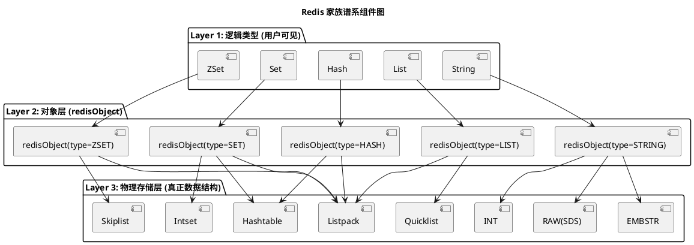

## Redis 由上至下


### 第一层：用户层(对外数据类型)
这是你在代码里、CLI（命令行）里直接操作的。
1. **String** (字符串)
2. **Hash** (哈希)
3. **List** (列表)
4. **Set** (集合)
5. **ZSet** (Sorted Set 有序集合)  
    (注：还有Bitmaps, HyperLogLog, GEO, Stream等，但面试核心是前5个)
---

### 第二层：中间层（桥梁）**RedisObject (元数据头)**


redisObject。它是Redis内部的一个**C语言结构体**。  
你可以把它理解为Java中的“对象头”或者快递包裹的“面单”。无论你存的是String还是Hash，Redis在内部都会先把它封装成一个 redisObject。

**它的核心作用是：告诉Redis，这个值是什么类型，用什么编码，以及数据存在哪里。**

redisObject 结构体主要包含这几个关键字段:
1. **type (4 bits)**: 对应第一层的类型（如：REDIS_STRING, REDIS_HASH...）。
    
2. **encoding (4 bits)**: 对应第三层的底层编码（告诉Redis这数据到底是用什么数据结构存的）。
    
3. **ptr**: 指针，指向底层真正的“数据结构”的内存地址。
    
4. **lru (24 bits)**: 记录最后一次被访问的时间（用于LRU淘汰算法，**面试常问：内存满了怎么淘汰？靠这个字段**）。
    
5. **refcount**: 引用计数（用于内存共享和回收）。
    
### 第三层：底层实现层（真实的物理存储）**Underlying Encodings (底层编码/数据结构)

这是Redis为了**省内存**和**追求极致性能**而设计的“黑科技”。同一个用户类型（第一层），在数据量不同时，会由Redis自动切换使用不同的底层数据结构（第三层）。

|用户视角 (Object Type)|底层编码 (Encoding)|对应的实际数据结构|触发场景/特点 (面试高频)|跳变阈值 (默认配置)|
|---|---|---|---|---|
|**String**|int|C语言 long 类型|字符串本身就是个整数，且在 Long 范围内。|超出 long 范围 → 转 SDS|
||embstr|SDS (Simple Dynamic String)|字符串较短（<44字节），元数据和数据在一块连续内存，分配快。|长度 ≤ 44 字节|
||raw|SDS (Simple Dynamic String)|字符串较长，需要分配两次内存。|长度 > 44 字节|
|**List**|quicklist|QuickList (双向链表+ZipList/Listpack)|早期版本用 Linkedlist 或 Ziplist，现在统一用 Quicklist。|每个节点大小由 `list-max-ziplist-size` 控制（默认 -2，约 8KB）|
|**Hash**|ziplist / listpack|压缩列表|键值对少且 value 短时使用，极致省内存。|`hash-max-ziplist-entries` 默认 512；`hash-max-ziplist-value` 默认 64 字节|
||hashtable|Dict (字典)|数据多了自动膨胀为哈希表。|超过上述阈值时跳变|
|**Set**|intset|整数集合|集合里全是整数且数量少时。底层是数组，有序，查找用二分。|`set-max-intset-entries` 默认 512|
||hashtable|Dict (字典)|有非整数或数量多了。|超过阈值或出现非整数元素时跳变|
|**ZSet**|ziplist / listpack|压缩列表|元素少且短。|`zset-max-ziplist-entries` 默认 128；`zset-max-ziplist-value` 默认 64 字节|
||skiplist|跳表 + Dict|元素多了，跳表支持范围查询高效，Dict 支持查分高效。|超过上述阈值时跳变|

## redis object


### String


### List


### Set

### Hash

```c
// from Redis 5.0.5
typedef struct dictht {
    // table：指向实际hash存储。存储可以看做一个数组，所以是 dictEntry** 的表示。
    // 实际是一个数组，数组的每个元素都是一个 dictEntry* 指针，指向冲突链表的头结点。
    dictEntry **table;
    
    // size：哈希表数组的大小。即 table 数组中包含的 dictEntry* 指针的空间数量。
    unsigned long size;
    
    // sizemask: 哈希表大小的掩码表示，总是等于 size - 1。
    // 这个属性用于通过哈希值快速计算键在 table 数组中的索引位置：
    // Index = hash & sizemask (利用位运算代替取模，性能更高)。
    unsigned long sizemask;
    
    // used：表示哈希表中已有的节点数量（已存储的键值对数量）。
    // 通过这个字段可以很方便地查询到目前 HASHTABLE 的元素总量。
    unsigned long used;
} dictht;

/* 图示中的含义（结构体外的补充说明）：

dictht
  -> table      // 指向底层的 dictEntry* 数组
  -> size       // 数组的长度
  -> sizemask   // size - 1，用于快速计算索引
  -> used       // 已存储的元素个数

dictEntry
  // 这是哈希表中的键值对节点，包含键、值以及指向下一个冲突节点的指针
  -> f1, v1     // 键（Field）和值（Value）的存储
  -> next       // 指向下一个 dictEntry 的指针，用于处理哈希冲突（链表法）

table
  // 数组本身，存储的是 dictEntry* 指针
  -> [0]        // 数组索引 0，指向一个 dictEntry 链表的头结点
  -> [1]        // 数组索引 1，指向 NULL 或另一个 dictEntry 链表
  -> [2]        // 数组索引 2，指向另一个 dictEntry 链表的头结点
*/
```

### Zset
#### 跳表
跳表是有序集合Zset的底层数据结构。本质上是链表，用空间换时间，类似数据库的B
树索引。
跳表有两个核心：1多级索引，2随机化，相比红黑树复杂的旋转和颜色调整来保持平衡，跳表通过随机数来决定节点是否需要上升一层，这种随机保持了索引的对数级别稀疏，从而使得平均查找时间复杂度为ologn
#### zset

zset的底层实现有ziplist和skiplist+ht
ziplist：
1.列表对象保存的所有字符串对象长度都小于64字节;
2.列表对象元素个数少于128个。
skiplist+ht

## redis底层结构
### 数据库结构
```c
typedef struct redisDb {
    dict *dict;                 /* 键空间（存储所有键值对的主字典） */
    dict *expires;              /* 保存带过期时间的键及其过期时间戳 */
    dict *blocking_keys;        /* 阻塞等待的键（如 BLPOP/BRPOP 等命令使用的键） */
    dict *ready_keys;           /* 已经准备好唤醒阻塞客户端的键（如 PUSH 操作触发） */
    dict *watched_keys;         /* 被事务 WATCH 的键，用于 MULTI/EXEC 的乐观锁机制 */
    int id;                     /* 数据库编号（默认 Redis 有 16 个数据库，编号 0–15） */
    long long avg_ttl;          /* 平均 TTL（存活时间），用于统计信息 */
    list *defrag_later;         /* 延迟碎片整理的键列表，用于内存优化 */
} redisDb;

```

过期键存在expires 字典上，dict和expires的key对象实际上存储是string对象指针，不会维护两个一样的string

### redis并发模型
核心是单线程的。辅助模块会有多线程多进程的功能，
例如复制模块使用多进程；部分非阻塞异步流程（unlink，flushall async）使用多线程；网络I/O解包从6.0开始使用多线程
#### redis 单线程快的原因
（1）内存操作；（2）高效数据结构（3）I/O多路复用