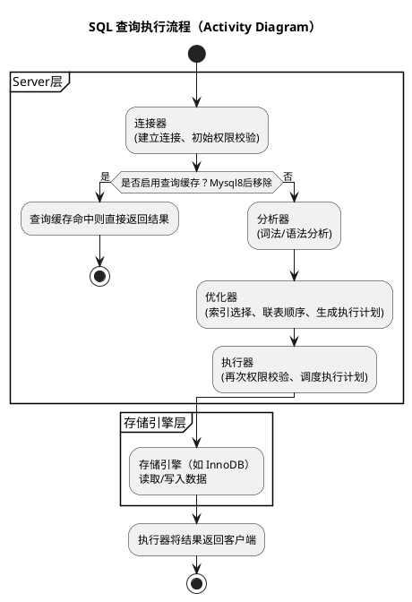

## 1 存储引擎
### 1.1 说一说执行一条查询 SQL 语句的全过程



### 1.2 MySQL 存储引擎有哪些？各自有什么区别?
mysql的存储引擎有MyISAM和InnoDB跟Memory等，一般常用的都是InnoDB，支持事务，锁粒度支持到行级别，支持外键，聚簇索引结构，也就是数据和主键索引在一起，查询性能相对MyISAM慢些。
MyISAM不支持事务，锁粒度只能到表级，不支持外键，是非聚簇索引，也就是索引和数据是分开的，查询性能相对快些，更新性能则比较差，适合读多写少。
Memory是将数据存储到内存中，读写快但是不具备持久性，适合临时存储。
### 1.3 MyISAM 和 InnoDB 存储引擎有什么区别?
InnoDB 引擎和 MyISAM 引擎在数据存储上有很大区别，InnoDB 引擎数据存储的方式采用的是索引组织表，在索引组织表中，数据即索引，索引即数据，因此表数据和索引数据都存储在同一个文件中。MyISAM 引擎数据存储的方式采用的是堆表，在堆表的组织结构中，数据和索引分开存储，因此表 数据和索引数据会分别放在两个不同的文件中存储，索引组织表有两个优势：
·在索引组织表将索引和数据保存在同一个 B+树中，相比非聚簇索引每次查询都需要回表，因此从聚簇索引中获取数据比非聚簇索引更快，查询数据会更快
·在索引组织表中，如果记录发生了修改，则其他索引无须进行维护，除非记录的主键发生了修改，而当堆表的数据发生改变且位置发生了变更，那么所有索引中的地址都要更新，这非常影响性能。
另外，InnoDB 引擎支持行级锁和事务，而 MyISAM 引I擎都不支持，只支持表锁。
### 1.4 `CHAR` 和 `VARCHAR` 有什么区别?
char是固定长度的字符串类型。在db中占用固定的存储空间，如果存储的字符串小于定义的长度，系统会自动用空格填充。
varchar是可变长度的字符串类型，实际存储时只占用实际字符串长度的空间，例如定义varchar(10)存储五字节字符串，那么只会占用5字节的存储空间，并且还会额外用1-2字节来存储"可变长字符串的长度"的空间。
从CPU角度 理论上char比varchar更快，少了长度处理的运算，但如果innodb buffer pool（位于内存）小于表大小时，也就是需要触发磁盘读写检索数据，那么varchar比char短，反而性能高。
## 2 索引结构
### 2.1 MySQL 有哪些索引类型?
MySql支持B+树索引，哈希索引、全文索引这三种类型。我们业务常用的是B+树索引，因为它是innodb引擎默认使用的索引类型，支持排序、分组、范围查询、模糊查询等功能
### 2.2 InnoDB 引擎的索引数据结构是什么?
Innodb使用的是B+树作为索引的数据结构，它的特点有
（1）InnoDB 存储引擎的主键索引B+树的非叶子节点只存放索引的键值跟指向子节点的指针列表，不存储实际的数据。叶子节点存储索引键值跟行数据，所以innodb的主键索引属于聚簇索引
（2）叶子结点列表：所有叶子节点用指针相连接，形成一个双向链表，支持快速的顺序访问和范围查询
（3）平衡树结构：所有叶子节点处于同一层，树的高度平衡，保证任何数据记录的查找插入删除和更新操作的路径长度相同，稳定性好
### 2.3 为什么索引用 B+ 树，而不用红黑树?
（1）主要原因是红黑树是二叉树而B+是n叉，因此数据多时，红黑树的树高会比B+树高多不少层，这样查询数据时会需要更多次磁盘I/O,查询性能不佳。
（2）B+树的用叶子节点存储数据，而且叶子节点用双向链表组织，因此范围查询很方便迅速，而红黑树要实现范围查询得走中序遍历，需要在树里跳来跳去，范围查询效率不如B+
### 2.4 为什么索引用 B+ 树，而不用 B 树?
（1）B+树只有叶子节点才存放索引和数据，而B树所有节点都会存放索引和数据，因此B+树可以比B树更矮胖，查询叶子节点的磁盘IO次数会更少（这是因为一般**一个节点通常对应一个页**（16KB数据），而b+的非叶子节点可以存更多的指针）
（2）B+便于范围查询，范围查询效率更高。B树需要中序遍历
（3 非重点）B+树增删查改效率更加稳定：B+ 树有大量的冗余节点，这些冗余数据可以让 B+ 树在插入、删除的效率都更高，比如删除根节点的时候，不会像 B 树那样会发生复杂的树的变化。另外，B+树把所有的用户记录都放到了叶子节点这一层，因此查询、插入、删除数据都需要走到最后一层，这不同于 B 树可能在任意一层找到数据，所以B+树更为稳定。
### 2.5 为什么索引用 B+ 树，而不用哈希表?
哈希表不支持范围查询和排序操作，也不支持联合索引最左匹配原则，如果重复键值多还容易造成哈希碰撞，而B+树则可以满足这些应用场景。
### 2.6 聚簇索引和非聚簇索引有什么区别?
聚簇索引和非聚簇索（二级索引）引最主要的区别是 B+树叶子节点存放的内容不同：
·聚簇索引的 B+树叶子节点存放的是主键值+完整的记录;
·非聚簇索引的 B+树叶子节点存放的是索引值+主键值;
如果查询语句的查询条件用了二级索引，但是查询的数据不是主键值,也不是二级索引值，这时在二级索引找到主键值后，就需要回表才能查找到数据，，需要扫描两次 B+树。如果查询的列是主键值和二级索引值时，因为只在二级索引就能查询到，这时候就会用到覆盖索引，不需要回表，只需要扫描一次 B+树。
## 3 索引应用
### 3.1 MySQL 有哪些索引?
我了解到 MySQL 有主键索引I、唯一索引I、普通索引I、前缀索引I、联合索引这几种索引。Innodb 引擎会要求每一张数据库表都必须要有一个主键索引，比如表里的 id 字段就是主键索引l。
然后针对查询比较频繁的字段，我们可以对这个字段建立普通索引，如果是多个字段的话，可以考虑建立联合索引，利用索引覆盖的特性提高查询效率。对于长文本、字符串等类型的字段，比如文章标题、商品名称等，我们可以只对这些字段的前缀部分建立索引，也就是建立前缀索引，这样可以减少索引的存储空间。

- 具体如下：
（1）主键索引：建立在主键字段上的索引，通常在创建表的时候一起创建，一张表上最多只有一个主键索引，不允许空值。
（2）普通索引：建立在普通字段上的索引
（3）唯一索引：建立在unique字段上的索引，一张表可以有多个唯一索引，索引列的值必须唯一，但允许有空值
```sql
CREATE TABLE users (
    id INT PRIMARY KEY,
    email VARCHAR(100) UNIQUE,
    phone VARCHAR(20) UNIQUE
);
```
举例如`email` 和 `phone` 都是唯一索引字段。那么表中不能有两行的 `email` 值相同，也不能有两行的 `phone` 值相同。根据 SQL 标准，**NULL ≠ NULL**，即两个 NULL 不被认为是“相等”的，所以说允许空值
（4）前缀索引：前缀索引是对字符类型的前几个字符建立的索引，而非整个字段，前缀可以建立在char、varchar、binary、varbinary列上，使用前缀索引的目的是为了减少索引占用的存储空间，提升查询效率
（5）联合索引：将多个字段组合成一个索引
### 3.2 为什么要建索引？
没有建立索引的时候查询数据，搜索时间复杂度是O（n），这样的查询效率比较低。
简历了索引后，索引列数据会按照顺序存储，这时候我们可以用类似二分搜索的方式去快速查数据，B+树索引是多叉树，搜索复杂是O（logdN），这样就提高了搜索速度。
除此之外还可以避免外部排序以及使用临时表的问题，以及将随机IO变成顺序IO
### 3.3 我们一般选择什么样的字段来建立索引?
可以对频繁用于**Where**查询条件的字段建立索引，如果查询条件不止一个字段，可以建立联合索引。
还有对于经常用于**排序**、**分组**的字段建立索引。这样在查询的时候就不需要再去做一次排序了，因为建立索引后B+树中的数据都是排序好的。
不过对于区分度不高的字段没必要建立索引。如果mysql的优化器发现某个值在表中出现的比例很高时 会忽略索引进行全表扫描，这样索引就没价值了。
### 3.4 索引越多越好吗？
不是的，索引虽然能提高查询效率，但是多建立一个索引，就意味着新生成1个 B+树索引，是需要**占用存储空间**的，特别是在表数据量非常大的时候，索引占用的空间越大。
还有，索引越多数据库的**写入性能会下降**，因为每次对表进行增删改操作的时候，都需要去维护各个 B+ 树索引的有序性。
### 3.5 索引怎么优化？
（1）对于只需要查询几个字段数据的sql来说，我们可以针对这些字段建立联合索引，这样查询方式就变成覆盖索引了，避免回表跟大量IO操作。
（2）主键索引应该是递增的值，索引是按照顺序存储数据的，如果主键的值是随机的值，可能会引发页分裂。页分裂会导致大量内存碎片，这样索引结构就不紧凑了，影响查询效率
（3）避免写出让索引失效的语句，比如对索引进行计算、函数、类型转换等。用联合索引要遵守最左匹配原则；
### 3.6 ❌ 常见让索引失效的写法：

|写法|问题|是否能用索引|
|---|---|---|
|`WHERE YEAR(create_time) = 2023`|使用函数|❌ 否|
|`WHERE price + 10 > 100`|计算表达式|❌ 否|
|`WHERE phone = 13800000000`（phone 是字符串，但传入数字）|类型不匹配|❌ 否|
|`WHERE name LIKE '%abc'`|前缀模糊匹配|❌ 否|

### 3.7 ✅ 正确写法（避免索引失效）：

| 写法                                                        | 优化说明        |
| --------------------------------------------------------- | ----------- |
| `WHERE create_time BETWEEN '2023-01-01' AND '2023-12-31'` | 避免函数，保留字段原样 |
| `WHERE price > 90`                                        | 把计算移到右边     |
| `WHERE phone = '13800000000'`                             | 保持类型一致      |
| `WHERE name LIKE 'abc%'`                                  | 后缀模糊匹配可用索引  |
|                                                           |             |
（4）对于大字符串列可以考虑使用前缀索引
### 3.8 什么情况下会回表查询？
在使用二级索引进行查询的时候，如果查询的列，不能在二级索引中全部查询到，那么就会发生回表的过程，先通过二级索引的值查到聚簇索引值（即主键id），再通过聚簇索引的值定位行记录数据，需要扫描两次索引 B+树，它的性能较扫一遍索引树更低。
### 3.9 什么是覆盖索引？
当查询的数据是能在二级索引的叶子节点里查询到的话，这时就**不用再回主键索引查**了，那就不需要回到主键索引去查行记录了，这种不需要回表的过程，就叫覆盖索引I，这种查询方式效率会比较高，只需要查二级索引这一棵 B+ 树。
### 3.10 建立了索引，查询的时候一定会用到索引吗？
不是的，有两种情况不走
（1）对索引字段进行左模糊匹配，表达式计算、函数、隐式类型转换，这时候查询就不能走索引了，只能全表扫描。在对联合索引字段进行查询时，没有遵循最左匹配原则，也会发生索引失效
（2）优化器会基于成本考虑选择查询方式，在二级索引查询时，会计算回表和全表扫描的成本，如果回表的代价太高，优化器就不会走索引
### 3.11 什么是最左匹配原则？
假设有一个（a，b，c）联合索引l，它的存储顺序是先按 a 排序，在 a 相同的情况再按 b 排序，在 b 相同的情况再按 c 排序。 由于这个的特性，在使用联合索引时，存在最左匹配原则，具体的规则:
- MySQL 会从联合索引I从最左边的索引列开始匹配查询条件，然后依次从从左到右的顺序匹配，如果查询条件没有使用到某个列，那么该列右边的所有列都无法使用走索引。
- 当查询条件中使用了某个列，但是该列的值包含范围查询，范围查询的字段可以用到联合索引，但是在范围查询字段的后面的字段无法用到联合索引。所以，我们在使用联合索引的时候，要遵守最左匹配原则，否则可能会出现部分索引字段走不了索引。
(在联合索引中，**第二个字段的排序是依赖于第一个字段的**。只有当第一个字段**相等**（值固定）时，第二个字段才是有序的；一旦第一个字段是**范围**（值不固定），第二个字段在全局看就是**乱序**的。)
### 3.12 联合索引 `(a,b,c)`，下面的查询语句会不会走索引？具体哪些字段能走？
  1. `select * from T where a=1 and b=2 and c=3;
  会，符合最左匹配原则，abc都走
  2. `select * from T where a=1 and b>2 and c=3;`
范围查询后面的字段无法使用索引，但只有a，b走，c不走索引，不过可以进行索引下推
  3. `select * from T where c=1 and a=2 and b=3;
abc都能走索引，mysql优化器会帮我们调整字段的查询顺序，也符合最左匹配原则。
  4. `select * from T where a=2 and c=3;`
a会走索引，而c不会，不过c可以被索引下推
  5. `select * from T where b=2 and c=3;`
bc都走不了索引
  6. `select (a,b) from T where a=1 and b>2;
ab都能走索引，而且是覆盖查询不需要回表
#### 3.12.1 什么是索引下推
  - **传统方式**：先用索引找主键，再回表取整行数据，最后在 Server 层判断是否满足 `WHERE` 条件。
- **索引下推**：在**存储引擎层**就用索引字段判断是否满足 `WHERE` 条件，**不满足的直接丢弃，避免回表**。
- **好处**：减少不必要的回表 I/O，尤其在大表或低选择性字段上效果显著。

### 3.13 `where a>1 and b=2 and c<3` 怎么建立索引？
创建bca或者bac联合索引，这样b 跟 c/a能走索引，最后一个可以走索引下推。

## 4 事务
### 4.1 MySQL 事务有什么特性?
ACID。
（1）Atomicity 原子性：一个事务中的所有操作，要么都成功，要么都不完成，如果事务在执行过程中出错，会回滚到事务开始前的状态 （通过undolog）
（2）Consistency 一致性：是指事务操作前后，事务前后满足业务/约束规则（例如 转账前后，两个账户的总余额不变，**数据库始终满足“资金守恒”这个业务规则**。）
（3）Isolation  隔离性：允许多个并发事务对数据进行读写和修改，隔离性可以防止多个事务并发执行时由于交叉执行导致数据的不一致，因为多个事务使用相同的数据时，不会相互干扰。
（4）Duration  持久性：事务处理结束后，对数据的修改就是永久的，即使系统故障也不会丢失。
### 4.2 事务的隔离性如何保证?
由MVCC(Multi-Version Concurrency Control，多版本并发控制)和锁保证的。
例如RR（可重复读）的普通select （快照读）是通过MVVC保证事务隔离性。而当前读是（update）通过行级锁保障的。

### 4.3 事务的持久性如何保证？
通过redolog，也就是WAL（Write-Ahead Logging，预写日志）。
在修改数据时，会将本次对数据页的修改先以redolog的方式记录下来，这时候更新就算完成了。
而bufferpool的脏页会通过后台线程进行刷盘。
即使在脏页还没刷盘的时候发生了数据库重启，由于修改操作都记录到了 redo log，之前已提交的记录都不会丢失,重启后就通过 redo log;恢复脏页数据，从而保证了事务的持久性
### 4.4 事务的原子性如何保证？
通过undolog。
在事务还没提交前，历史数据就会记录到undolog中，如果事务执行过程中，出现了错误或者用户执行了rollback语句，mysql可以利用undolog中的历史数据，将数据恢复到事务开始前的状态，从而保障事务的原子性。
### 4.5 MySQL 事务隔离级别有哪些？分别解决哪些问题？
读未提交 RU ：最低级别隔离，指一个事务还没提交时，它做的变更就能被其他事务看到。存在脏读，不可重复读，幻读
读已提交 RC：解决脏读。指一个事务提交之后，它做的变更才能被其他事务看到;
可重复读 RR：指一个事务执行过程中看到的数据，一直跟这个事务启动时看到的数据是一致的，MySQL InnoDB 引擎的默认隔离级别
串行化：会对记录加上读写锁，在多个事务对这条记录进行读写操作时，如果发生了读写冲突的时候，后访问的事务必须等前一个事务执行完成，才能继续执行;。所有问题都可以避免，但是事务并发性能最差.


### 4.6 脏读和幻读有什么区别?
脏读是一个事务读到了另一个未提交事务修改过的数据，如果另外一个事务回滚了，刚才读到的数据就与数据库里的数据不一致了。
幻读是前后两次的查询的结果集的数量是不同，比如，如果 select 执行了两次，但第二次返回了第一次没有返回的行数据，则该行是"幻像"行。
### 4.7 MySQL 默认的隔离级别是什么？怎么实现的？
RR 可重复读。通过MVCC实现的
### 4.8 介绍一下 MVCC
MVCC是多版本并发控制，通过记录历史版本数据，解决读写并发冲突问题，避免了读数据时加锁，提高了事务的并发性能。
Mysql将历史数据存储在undolog中，类似链表，mysql数据行有两个隐藏列，一个是事务ID，一个就是指向undolog的指针。
当事务开启时。执行第一条select语句时候，会创建readview，其记录了还没提交的事务，通过与历史数据的事务ID比较，就能根据可见性规则进行判断，判断这个记录是否可见，如果可见就将数据返回给客户端，否则沿着undolog版本链查找直到找到第一个可见的数据。
### 4.9 MVCC 如何判断行记录对某一个事务是否可见?
**记录**有两个隐藏列，一个是**事务id**，一个是指向历史记录的
Readview是属于事务的属性，有四个重要字段：
（1）创建readview的当前事务id
（2）活跃事务id列表
（3）活跃事务id列表中的最小id
（4）下一个事务的id
如果 **记录的事务id**<活跃事务id列表中的最小id，说明该记录对该事务是可见的
如果记录的事务id>=下一个事务id，说明该记录对该事务不可见。
如果活跃事务id列表中的最小id<=记录的事务id<下一个事务id,这时候需要判断记录的事务id在不在活跃事务id列表中（**事务开启是顺序的，但事务结束（提交）的顺序是随机的。**，也就是可能1,2,3里2先完成事务），如果不在，说明是可见的。如果在，说明不可见。
### 4.10 读已提交和可重复读隔离级别实现中 MVCC 的区别?
主要区别是readview的生成时机不同。
（1）读已提交隔离在事务开启后，每次select时都会生成一个新的readview，所以每次select都能看到其他事务最近提交的数据。
（2）可重复读在事务开启后，执行第一条select时生成一个readview，然后整个事务期间都复用这个readview，所以一个事务启动时看到的数据一直是一致的
### 4.11 可重复读解决了什么问题？有没有完全解决幻读?
可重复读解决了不可重复读的问题，没有完全解决幻读。
### 4.12 可重复读为什么不能完全避免幻读？什么情况下出现幻读？
可重复读级别下，如果是先快照读（普通select）再当前读（select for update）的场景是有可能出现幻读的。
**RR 级别下发生幻读的原因，是因为 MySQL 采用了 ‘MVCC（快照）’ 与 ‘当前读（实时）’ 混用的混合一致性模型。**
- 场景1：**事务A通过快照读**查出来id > 100有一条记录，事务B这时候去插入了id=200的记录并提交了事务，这时候**事务a再去用当前读**查询id>100的，就会查出来2条记录了。
- 场景2:事务A通过快照读查询id=5的记录，当前db没这个记录。但是随后事务B向表中插入了id=5的记录并提交了事务，接着事务A对id=5进行更新操作，这时新纪录隐藏列的事务id就变成了事务A的事务id，事务A再去select查就能查到了，事务A前后两次查询结果不一样，发生幻读。
### 4.13 什么是快照读跟当前读

|          |                            |                                                       |
| -------- | -------------------------- | ----------------------------------------------------- |
| 特性       | 快照读 (Snapshot Read)        | 当前读 (Current Read)                                    |
| **核心机制** | MVCC (ReadView + Undo Log) | Next-Key Lock (行锁 + 间隙锁)                              |
| **典型语法** | 普通 SELECT                  | SELECT FOR UPDATE/SHARE<br>UPDATE<br>DELETE<br>INSERT |
| **读到什么** | 可能是历史版本                    | 绝对是最新版本                                               |
| **是否加锁** | **无锁** (极快)                | **加锁** (会阻塞)                                          |
| **并发能力** | 高并发                        | 低 (串行化排队)                                             |
## 5 锁
### 5.1 详细说一下 MySQL 数据库中锁的分类
根据锁粒度的不同可以分为全局锁，表级锁，行级锁
- 全局锁：FLUSH TABLES WITH READ LOCK;，会使得整个数据库实例处于只读状态
- 表级锁：我们修改表结构时，mysql就会对这张表加一个元数据锁（表级锁的一种）。
- 行级锁：目前只有Innodb实现，Innodb实现的行级锁主要有
（1）记录锁：仅仅锁住索引记录的一行。而且有**S锁**(共享锁/读锁：如果一个事务持有了某记录的s锁，其他事务也可以读这个记录，但任何人都不能改记录)和**X锁**（ Exclusive排他锁/写锁：如果一个事务持有了某记录的X锁，其他事务不能读不能改该记录）之分，满足读写互斥，写写互斥。
（2）间隙锁：锁住两个索引记录间的间隙（开区间），防止其他事务在这个间隙里**插入**新数据，如锁住(1,6)则不能插入3
（3）临键锁（NextKeyLock）：记录锁和间隙锁的结合，锁住记录本身跟记录前的间隙，左开右闭 (1,6]
（4）插入意向锁： **InnoDB 在插入数据之前，用来判断由于间隙锁的存在而是否需要等待**的一种特殊的间隙锁。

它的最大特点是**彼此互不排斥**。

比如有两个事务分别想在同一个间隙 (1, 10) 中插入 id=5 和 id=6。  
如果没有外部的 Gap Lock 阻拦，这两个事务生成的插入意向锁是兼容的，它们可以并发插入，不会互相阻塞。

只有当这个区间已经被别的事务加了 Gap Lock 或 Next-Key Lock（比如为了防幻读）时，插入意向锁才会被阻塞，导致插入等待。

**所以，插入意向锁是为了提升并发插入性能而设计的。**”
### 5.2 在线上修改表结构，会发生什么？
事务在对表进行读写操作时会生成元数据读锁，修改表结构会生成元数据写锁，导致读写冲突，修改表结构的操作会阻塞，且后续事务的增删查改也会阻塞。
### 5.3 InnoDB 存储引擎中的行级锁有哪些?
（1）记录锁 record lock：又细分为S锁（读锁）和X锁（写锁）
例如 如下sql会加x锁
```sql
mysql > begin;
mysql > select * from t_test where id = 1 for update;
mysql > commit;
```

 （2）间隙锁 gap lock 可以避免其他事务往间隙里插入新记录
（3）临键锁 next key lock 是记录锁和间隙锁的组合，所以它既可以避免其他事务对该记录进行删除和更新操作，也可以避免其他事务往间隙里插入新记录。
```
临键锁（Next-Key Lock）是以 B+ 树索引中真实的记录为边界，锁住“当前记录”及其与“前一条记录”之间的物理间隙，形成左开右闭的区间。
```

（4）插入意向锁：插入意向锁和间隙锁是互斥的关系，其他事务插入的时候，发现插入位置的下一条记录有间隙锁的话，才会生成的插入意向锁，并且这时候锁的状态是阻塞状态，目的是告诉用户插入的位置存在间隙锁
### 5.4 一条 `UPDATE` 语句没有带 `WHERE` 条件，加的是什么锁?
Innodb加锁是索引加锁。
在RR可重复读级别，更新不带where条件会全表扫描并对每条记录都加nextkey 临键锁，相当于锁住全表；
在RC读已提交级别，没有间隙锁，更新不带where条件会对每条记录都加记录锁。
### 5.5 MySQL 怎么实现乐观锁?
在表中增加一个版本号字段。
每次更新数据时都要带上版本号作为where条件，并update version+1，如果版本号和表记录一直，说明更新成功，否则要重试获取新的数据
### 5.6 了解过 MySQL 死锁问题吗?
在并发事务中，当两个事务出现了循环资源依赖，这两个事务都在等待别的事务释放资源时，就会导致两个事务都会进入无限等待的状态，这时候就发生了死锁
### 5.7 MySQL 怎么避免死锁?
死锁是不能完全避免的，消减方案有
（1）缩短锁持续时间降低概率。因为mysql锁在事务提交时才会释放。
- 如果事务需要锁多个行，应将可能造成锁冲突的锁申请时机尽量后放，这样事务的持久锁的时间会比较短。
- 将大事务拆成多个小事务处理。
（2）通过减少间隙锁降低概率。如果幻读和不可重复读对业务影响不大，可以改成读已提交级别隔离，因为没有间隙锁。
（3）减少加锁范围。这需要给表添加合适索引，因为不走索引会对全表记录加行级锁，死锁概率会更高。
（4）合理设置锁等待超时阈值的mysql参数，当一个事务等待时间超过该值后会回滚当前语句（而不是整个事务），如果要回滚整个事务也可以设置innodb_rollback_on_timeout为ON
（5）设置mysql参数主动开启死锁检测，这样mysql在检测到死锁后就会主动回滚死锁链条中的某一个事务，让其他事务正常执行下去。
## 6 日志
### 6.1 MySQL 有哪些日志？有什么区别?
undolog redolog跟binlog。
（1）undolog是innodb存储引擎层的。是逻辑日志。innodb会记录更新前的数据到undolog中，事务回滚时用undolog恢复。因此undolog是保障事务原子性的，此外也和锁一起用于支撑MVCC的实现。
（2）redolog是innodb存储引擎层的。是物理日志。具体记录了某个数据页做了什么修改。实现了事务的持久性。主要用于服务器掉电后的故障恢复。
比如事务提交后，脏页数据还没刷盘。如果此时断电了，脏页的数据就丢失了，这种情况下redolog日志则可以让mysql把已提交事务的数据恢复回来
（3）binlog是server层的。用于数据备份和主从复制，在完成一条更新操作后，server层会生成一条binlog，等事务提交之后，会将事务产生的所有binlog统一写入binlog文件。binlog会记录所有数据库表结构变更和表数据修改的日志，不会记录查询。
### 6.2 `redo log` 和 `binlog` 的区别和应用场景?
redolog是innodb存储引擎的物理日志。主要用于崩溃恢复。是一块循环写的用于救急的日志。
binlog则是server层的对数据库的增删改的操作日志。是追加写的。主要用于数据库备份和归档，也用于主从复制。binlog有三种日志格式，可能是sql，数据本身或者两者混合。
### 6.3 `redo log` 是怎么实现持久化的?
redolog保存的内容是物理日志，记录了innodb对某个数据页的修改操作，当事务提交时，redolog会先刷入磁盘，因为redolog保存了数据页的修改操作，即使脏页数据没有刷盘时 数据库宕机了，重启后mysql通过重放redolog就能恢复未刷盘的脏页，从而保障数据持久化。
### 6.4 为什么事务提交需要两阶段提交？
保障redolog和binlog逻辑一致，从而保证主从复制时不会出现数据不一致的情况
### 6.5 两阶段提交的过程是怎样的？

两阶段提交把事务提交拆分成两个阶段，分别是准备阶段跟提交阶段。
- 准备阶段会把redolog状态置为prepare状态，然后将redolog刷入磁盘。
- 提交阶段会将binlog刷入磁盘，然后设置redolog为commit状态，完成两阶段提交。

在两阶段提交中 是以binlog刷入磁盘时机作为事务提交成功的标志的。
- 如果binlog没刷入磁盘，mysql就崩溃了，mysql重启时需要回滚事务
- 如果binlog刷入了磁盘，即使redolog没设置为commit，mysql重启时也会提交事务。
## 7 性能优化
### 7.1 怎么找到慢 SQL?
可以开启慢查询日志，mysql就会自动将执行比较慢的sql语句记录到慢查询日志中（多慢算慢可以自行设置）
### 7.2 如何优化慢 SQL?
（1）优化数据访问：要先确认这条查询语句是否查询了不必要的数据行，可以通过limit子句来缩减查询返回的数据行数，如果查询语句用了` select * `
需要改进sql语句，只返回需要查询的列。
（2）切分查询：针对一个大查询可以拆分成多个小查询，每个小查询只返回一部分查询数据。比如删除一千万行数据，可以改进成分批删除，这样不仅降低对服务器的性能影响，也减少了删除时锁的持续时间。
（3）覆盖索引：如果没有索引字段的话，就需要考虑建立索引或者联合索引。通过覆盖索引的查询 避免回表查询，提高查询性能。
（4）避免索引失效：避免对索引进行计算或函数操作，联合索引没有遵守最左匹配原则等。
（5）分解联表查询：针对联表查询sql，可以拆分成多个单表查询的语句，然后在业务层聚合数据，或者增加冗余字段减少联表查询。
（6）排序优化：针对orderby排序，如果执行计划的EXPLAIN的extra显示是文件排序，这时候可以对排序字段和其他字段建立联合索引避免走文件排序。
### 7.3 深分页场景如何优化？
深分页问题是指在海量数据查询中，随着分页偏移量（Offset）的增大，数据库必须遍历并丢弃大量无用记录才能定位到目标数据，从而导致查询耗时呈线性增长的性能瓶颈。解决方案如下
（1）在业务上改进，将第几页改成下一页，先记录好上一页的最后一条记录的id，下次直接从该记录位置进行扫描，避免mysql扫描大量不需要的行然后再抛弃。
（2）覆盖索引+子查询。子查询语句
### 7.4 如果 SQL 和索引都没问题，查询还是很慢怎么办?

## 8 高可用
### 8.1 MySQL 主从复制的过程是怎么样?
### 8.2 MySQL 提供了几种复制模式？默认的复制模式是什么?
### 8.3 什么是分库分表？什么时候需要分表？什么时候需要分库？
### 8.4 分库分表后，会产生什么问题？怎么解决？
