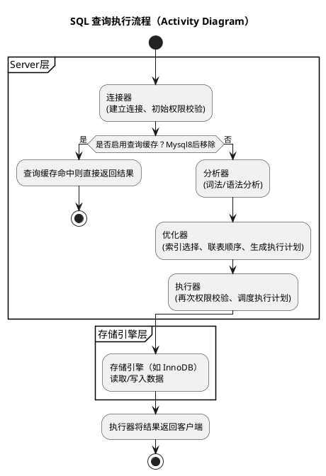

## 存储引擎
### 说一说执行一条查询 SQL 语句的全过程



### MySQL 存储引擎有哪些？各自有什么区别?
mysql的存储引擎有MyISAM和InnoDB跟Memory等，一般常用的都是InnoDB，支持事务，锁粒度支持到行级别，支持外键，聚簇索引结构，也就是数据和主键索引在一起，查询性能相对MyISAM慢些。
MyISAM不支持事务，锁粒度只能到表级，不支持外键，是非聚簇索引，也就是索引和数据是分开的，查询性能相对快些，更新性能则比较差，适合读多写少。
Memory是将数据存储到内存中，读写快但是不具备持久性，适合临时存储。
### MyISAM 和 InnoDB 存储引擎有什么区别?
InnoDB 引擎和 MyISAM 引擎在数据存储上有很大区别，InnoDB 引擎数据存储的方式采用的是索引组织表，在索引组织表中，数据即索引，索引即数据，因此表数据和索引数据都存储在同一个文件中。MyISAM 引擎数据存储的方式采用的是堆表，在堆表的组织结构中，数据和索引分开存储，因此表 数据和索引数据会分别放在两个不同的文件中存储，索引组织表有两个优势：
·在索引组织表将索引和数据保存在同一个 B+树中，相比非聚簇索引每次查询都需要回表，因此从聚簇索引中获取数据比非聚簇索引更快，查询数据会更快
·在索引组织表中，如果记录发生了修改，则其他索引无须进行维护，除非记录的主键发生了修改，而当堆表的数据发生改变且位置发生了变更，那么所有索引中的地址都要更新，这非常影响性能。
另外，InnoDB 引擎支持行级锁和事务，而 MyISAM 引I擎都不支持，只支持表锁。
### `CHAR` 和 `VARCHAR` 有什么区别?
char是固定长度的字符串类型。在db中占用固定的存储空间，如果存储的字符串小于定义的长度，系统会自动用空格填充。
varchar是可变长度的字符串类型，实际存储时只占用实际字符串长度的空间，例如定义varchar(10)存储五字节字符串，那么只会占用5字节的存储空间，并且还会额外用1-2字节来存储"可变长字符串的长度"的空间。
从CPU角度 理论上char比varchar更快，少了长度处理的运算，但如果innodb buffer pool（位于内存）小于表大小时，也就是需要触发磁盘读写检索数据，那么varchar比char短，反而性能高。
## 索引结构
### MySQL 有哪些索引类型?
MySql支持B+树索引，哈希索引、全文索引这三种类型。我们业务常用的是B+树索引，因为它是innodb引擎默认使用的索引类型，支持排序、分组、范围查询、模糊查询等功能
### InnoDB 引擎的索引数据结构是什么?
Innodb使用的是B+树作为索引的数据结构，它的特点有
（1）InnoDB 存储引擎的主键索引B+树的非叶子节点只存放索引的键值跟指向子节点的指针列表，不存储实际的数据。叶子节点存储索引键值跟行数据，所以innodb的主键索引属于聚簇索引
（2）叶子结点列表：所有叶子节点用指针相连接，形成一个双向链表，支持快速的顺序访问和范围查询
（3）平衡树结构：所有叶子节点处于同一层，树的高度平衡，保证任何数据记录的查找插入删除和更新操作的路径长度相同，稳定性好
### 为什么索引用 B+ 树，而不用红黑树?
（1）主要原因是红黑树是二叉树而B+是n叉，因此数据多时，红黑树的树高会比B+树高多不少层，这样查询数据时会需要更多次磁盘I/O,查询性能不佳。
（2）B+树的用叶子节点存储数据，而且叶子节点用双向链表组织，因此范围查询很方便迅速，而红黑树要实现范围查询得走中序遍历，需要在树里跳来跳去，范围查询效率不如B+
### 为什么索引用 B+ 树，而不用 B 树?
（1）B+树只有叶子节点才存放索引和数据，而B树所有节点都会存放索引和数据，因此B+树可以比B树更矮胖，查询叶子节点的磁盘IO次数会更少（这是因为一般**一个节点通常对应一个页**（16KB数据），而b+的非叶子节点可以存更多的指针）
（2）B+便于范围查询，范围查询效率更高。B树需要中序遍历
（3 非重点）B+树增删查改效率更加稳定：B+ 树有大量的冗余节点，这些冗余数据可以让 B+ 树在插入、删除的效率都更高，比如删除根节点的时候，不会像 B 树那样会发生复杂的树的变化。另外，B+树把所有的用户记录都放到了叶子节点这一层，因此查询、插入、删除数据都需要走到最后一层，这不同于 B 树可能在任意一层找到数据，所以B+树更为稳定。
### 为什么索引用 B+ 树，而不用哈希表?
哈希表不支持范围查询和排序操作，也不支持联合索引最左匹配原则，如果重复键值多还容易造成哈希碰撞，而B+树则可以满足这些应用场景。
### 聚簇索引和非聚簇索引有什么区别?
聚簇索引和非聚簇索（二级索引）引最主要的区别是 B+树叶子节点存放的内容不同：
·聚簇索引的 B+树叶子节点存放的是主键值+完整的记录;
·非聚簇索引的 B+树叶子节点存放的是索引值+主键值;
如果查询语句的查询条件用了二级索引，但是查询的数据不是主键值,也不是二级索引值，这时在二级索引找到主键值后，就需要回表才能查找到数据，，需要扫描两次 B+树。如果查询的列是主键值和二级索引值时，因为只在二级索引就能查询到，这时候就会用到覆盖索引，不需要回表，只需要扫描一次 B+树。
## 索引应用
### MySQL 有哪些索引?
我了解到 MySQL 有主键索引I、唯一索引I、普通索引I、前缀索引I、联合索引这几种索引。Innodb 引擎会要求每一张数据库表都必须要有一个主键索引，比如表里的 id 字段就是主键索引l。
然后针对查询比较频繁的字段，我们可以对这个字段建立普通索引，如果是多个字段的话，可以考虑建立联合索引，利用索引覆盖的特性提高查询效率。对于长文本、字符串等类型的字段，比如文章标题、商品名称等，我们可以只对这些字段的前缀部分建立索引，也就是建立前缀索引，这样可以减少索引的存储空间。

- 具体如下：
（1）主键索引：建立在主键字段上的索引，通常在创建表的时候一起创建，一张表上最多只有一个主键索引，不允许空值。
（2）普通索引：建立在普通字段上的索引
（3）唯一索引：建立在unique字段上的索引，一张表可以有多个唯一索引，索引列的值必须唯一，但允许有空值
```sql
CREATE TABLE users (
    id INT PRIMARY KEY,
    email VARCHAR(100) UNIQUE,
    phone VARCHAR(20) UNIQUE
);
```
举例如`email` 和 `phone` 都是唯一索引字段。那么表中不能有两行的 `email` 值相同，也不能有两行的 `phone` 值相同。根据 SQL 标准，**NULL ≠ NULL**，即两个 NULL 不被认为是“相等”的，所以说允许空值
（4）前缀索引：前缀索引是对字符类型的前几个字符建立的索引，而非整个字段，前缀可以建立在char、varchar、binary、varbinary列上，使用前缀索引的目的是为了减少索引占用的存储空间，提升查询效率
（5）联合索引：将多个字段组合成一个索引
### 为什么要建索引？
没有建立索引的时候查询数据，搜索时间复杂度是O（n），
### 我们一般选择什么样的字段来建立索引?
### 索引越多越好吗？
### 索引怎么优化？
### 什么情况下会回表查询？
### 什么是覆盖索引？
### 建立了索引，查询的时候一定会用到索引吗？
### 什么是最左匹配原则？
### 联合索引 `(a,b,c)`，下面的查询语句会不会走索引？具体哪些字段能走？
  1. `select * from T where a=1 and b=2 and c=3;`
  2. `select * from T where a=1 and b>2 and c=3;`
  3. `select * from T where c=1 and a=2 and b=3;`
  4. `select * from T where a=2 and c=3;`
  5. `select * from T where b=2 and c=3;`
  6. `select (a,b) from T where a=1 and b>2;`
### `where a>1 and b=2 and c<3` 怎么建立索引？

## 事务
### MySQL 事务有什么特性?
### 事务的隔离性如何保证?
### 事务的持久性如何保证？
### 事务的原子性如何保证？
### MySQL 事务隔离级别有哪些？分别解决哪些问题？
### 脏读和幻读有什么区别?
### MySQL 默认的隔离级别是什么？怎么实现的？
### 介绍一下 MVCC
### MVCC 如何判断行记录对某一个事务是否可见?
### 读已提交和可重复读隔离级别实现 MVCC 的区别?
### 可重复读解决了什么问题？有没有完全解决幻读?
### 可重复读为什么不能完全避免幻读？什么情况下出现幻读？

## 锁
### 详细说一下 MySQL 数据库中锁的分类
### 在线上修改表结构，会发生什么？
### InnoDB 存储引擎中的行级锁有哪些?
### 一条 `UPDATE` 语句没有带 `WHERE` 条件，加的是什么锁?
### MySQL 怎么实现乐观锁?
### 了解过 MySQL 死锁问题吗?
### MySQL 怎么避免死锁?

## 日志
### MySQL 有哪些日志？有什么区别?
### `redo log` 和 `binlog` 的区别和应用场景?
### `redo log` 是怎么实现持久化的?
### 为什么事务提交需要两阶段提交？
### 两阶段提交的过程是怎样的？

## 性能优化
### 怎么找到慢 SQL?
### 如何优化慢 SQL?
### 深分页场景如何优化？
### 如果 SQL 和索引都没问题，查询还是很慢怎么办?

## 高可用
### MySQL 主从复制的过程是怎么样?
### MySQL 提供了几种复制模式？默认的复制模式是什么?
### 什么是分库分表？什么时候需要分表？什么时候需要分库？
### 分库分表后，会产生什么问题？怎么解决？
