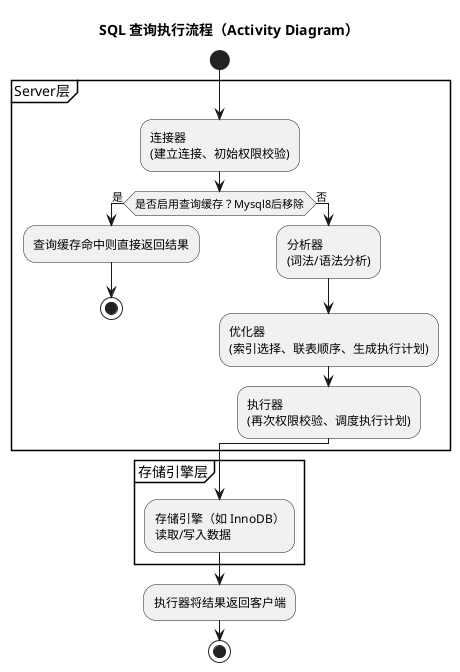

# MySQL 题库笔记

## 存储引擎
### 说一说执行一条查询 SQL 语句的全过程

### MySQL 存储引擎有哪些？各自有什么区别?
mysql的存储引擎有MyISAM和InnoDB跟Memory等，一般常用的都是InnoDB，支持事务，锁粒度支持到行级别，支持外键，聚簇索引结构，也就是数据和主键索引在一起，查询性能相对MyISAM慢些。
MyISAM不支持事务，锁粒度只能到表级，不支持外键，是非聚簇索引，也就是索引和数据是分开的，查询性能相对快些。
Memory是将数据存储到内存中
### MyISAM 和 InnoDB 存储引擎有什么区别?

### `CHAR` 和 `VARCHAR` 有什么区别?

## 索引结构
### MySQL 有哪些索引类型?
### InnoDB 引擎的索引数据结构是什么?
### 为什么索引用 B+ 树，而不用红黑树?
### 为什么索引用 B+ 树，而不用 B 树?
### 为什么索引用 B+ 树，而不用哈希表?
### 聚簇索引和非聚簇索引有什么区别?

## 索引应用
### MySQL 有哪些索引?
### 为什么要建索引？
### 我们一般选择什么样的字段来建立索引?
### 索引越多越好吗？
### 索引怎么优化？
### 什么情况下会回表查询？
### 什么是覆盖索引？
### 建立了索引，查询的时候一定会用到索引吗？
### 什么是最左匹配原则？
### 联合索引 `(a,b,c)`，下面的查询语句会不会走索引？具体哪些字段能走？
  1. `select * from T where a=1 and b=2 and c=3;`
  2. `select * from T where a=1 and b>2 and c=3;`
  3. `select * from T where c=1 and a=2 and b=3;`
  4. `select * from T where a=2 and c=3;`
  5. `select * from T where b=2 and c=3;`
  6. `select (a,b) from T where a=1 and b>2;`
### `where a>1 and b=2 and c<3` 怎么建立索引？

## 事务
### MySQL 事务有什么特性?
### 事务的隔离性如何保证?
### 事务的持久性如何保证？
### 事务的原子性如何保证？
### MySQL 事务隔离级别有哪些？分别解决哪些问题？
### 脏读和幻读有什么区别?
### MySQL 默认的隔离级别是什么？怎么实现的？
### 介绍一下 MVCC
### MVCC 如何判断行记录对某一个事务是否可见?
### 读已提交和可重复读隔离级别实现 MVCC 的区别?
### 可重复读解决了什么问题？有没有完全解决幻读?
### 可重复读为什么不能完全避免幻读？什么情况下出现幻读？

## 锁
### 详细说一下 MySQL 数据库中锁的分类
### 在线上修改表结构，会发生什么？
### InnoDB 存储引擎中的行级锁有哪些?
### 一条 `UPDATE` 语句没有带 `WHERE` 条件，加的是什么锁?
### MySQL 怎么实现乐观锁?
### 了解过 MySQL 死锁问题吗?
### MySQL 怎么避免死锁?

## 日志
### MySQL 有哪些日志？有什么区别?
### `redo log` 和 `binlog` 的区别和应用场景?
### `redo log` 是怎么实现持久化的?
### 为什么事务提交需要两阶段提交？
### 两阶段提交的过程是怎样的？

## 性能优化
### 怎么找到慢 SQL?
### 如何优化慢 SQL?
### 深分页场景如何优化？
### 如果 SQL 和索引都没问题，查询还是很慢怎么办?

## 高可用
### MySQL 主从复制的过程是怎么样?
### MySQL 提供了几种复制模式？默认的复制模式是什么?
### 什么是分库分表？什么时候需要分表？什么时候需要分库？
### 分库分表后，会产生什么问题？怎么解决？
