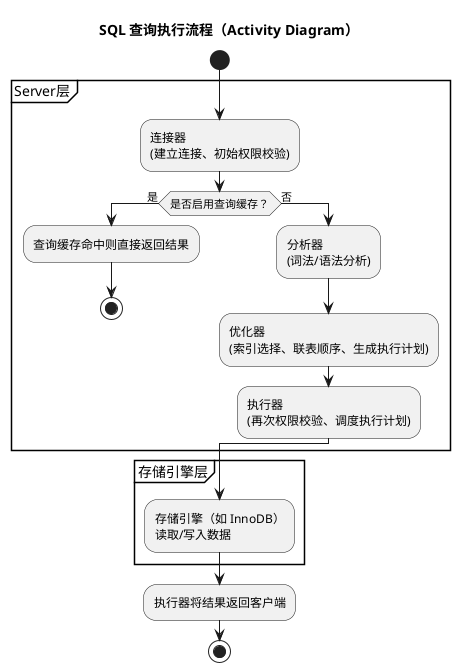

```plantuml
@startuml
title SQL 查询执行流程（Activity Diagram）

start

partition "Server层" {
  :连接器\n(建立连接、初始权限校验);
  if (是否启用查询缓存？) then (是)
    :查询缓存命中则直接返回结果;
    stop
  else (否)
    :分析器\n(词法/语法分析);
    :优化器\n(索引选择、联表顺序、生成执行计划);
    :执行器\n(再次权限校验、调度执行计划);
  endif
}

partition "存储引擎层" {
  :存储引擎（如 InnoDB）\n读取/写入数据;
}

:执行器将结果返回客户端;

stop
@enduml

```
