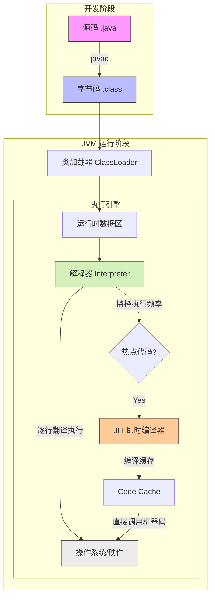

---

topic: Java 程序执行全过程 & 重载与重写

module: Java基础

mastery: 模糊

tags: [java, jvm, 类加载, 编译执行, 重载, 重写, 多态, 面试高频]

related: [JVM内存模型, 类加载机制, JIT编译, 动态绑定]

created: 2026-04-18

---

  

# Java 程序执行全过程

  

> [!summary] 一句话

> Java 代码经历 **编译（.java → .class）→ 类加载 → 运行时数据区分配 → 解释执行/JIT 编译执行** 四个阶段。

  

## 执行流程图

  



  

## 关键环节

  

- **编译**：`javac` 将源码编译为字节码，这是 Java 跨平台的基础——字节码与具体操作系统无关。

- **类加载**：ClassLoader 将 `.class` 文件加载进 JVM。面试常考双亲委派模型和类的生命周期。

- **内存分配**：运行时数据区划分为堆、栈、方法区等，各区域存什么、哪些线程共享是核心考点。

- **执行**：解释器逐行翻译执行；JVM 监控代码执行频率，热点代码交由 JIT 编译为机器码缓存到 Code Cache，后续直接调用。

  

> [!warning] 易错点

> ❌ "Java 是解释型语言" → 不完全对。Java 是**解释+编译混合模式**，热点代码由 JIT 编译为机器码缓存。

> ❌ "字节码直接在 CPU 上执行" → 字节码由 JVM 执行引擎翻译为机器指令，不能直接跑在 CPU 上。

  

---

  

# 重载 vs 重写

  

> [!summary] 一句话

> **重载 = 同名不同参（编译期静态绑定），重写 = 子类重新实现父类方法（运行期动态绑定）。**

  

**重载**发生在同一个类中，方法名相同但参数列表（个数、类型、顺序）不同，编译期就能确定调用哪个方法。返回值、访问权限、抛出异常的改变**不能**构成重载——仅靠返回值区分会直接编译报错。

  

**重写**是子类对父类方法的重新实现，运行期由 JVM 动态决定执行哪个版本。核心规则是 **"两同两小一大"**：

  

- **两同**：方法名、形参列表必须与父类完全一致

- **两小**：返回值 ≤ 父类（支持协变），声明异常 ≤ 父类

- **一大**：访问权限 ≥ 父类（不能缩小可见性）

  

```java

// ✅ 合法重载：参数不同

void print(String s) { }

void print(int i) { }

  

// ❌ 不算重载：仅返回值不同，编译报错

int print(String s) { return 0; }

```

  

> [!warning] 易错点

> ❌ "改返回值就能重载" → JVM 无法仅靠返回值区分方法调用，编译直接报错

> ❌ "重写可以抛更多异常" → 子类异常必须 ≤ 父类，否则编译不通过

> ❌ "重写可以把 public 改成 private" → 权限只能放大不能缩小

> ❌ "`static` 方法可以重写" → static 方法不存在重写，只有**隐藏**（hide）

  

> [!tip] 面试回答模板

> **重载**是让类以统一方式处理不同数据类型的手段，编译期静态绑定。

> **重写**是子类对父类行为的特化，是运行期多态的基础，受"两同两小一大"约束。