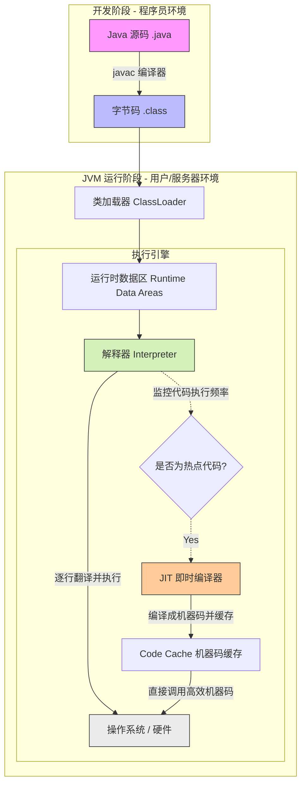

### 0.1 1、JavaJava 程序执行全过程




## 1 重载 (Overloading) —— 编译期多态

- **核心定义**：同一个类中，方法名相同，参数列表不同。
    
- **发生时机**：**编译期**（静态绑定）。
    
- **判定条件**：
    
    - **必须变**：参数个数、类型或顺序。
        
    - **不能变**：方法名。
        
    - **无关项**：返回值、访问权限、异常（仅靠这些无法构成重载）。
        
- **面试金句**：重载是让类以统一的方式处理不同数据类型的手段。
    

## 2 重写 (Overriding) —— 运行期多态

- **核心定义**：子类对父类方法的逻辑重新实现。
    
- **发生时机**：**运行期**（动态绑定/虚方法分派）。
    
- **核心规则：两同两小一大**
    
    1. **两同**：方法名、形参列表必须相同。
        
    2. **两小**：
        
        - **返回值**：子类返回类型 
            
            ```
            ≤≤
            ```
            
             父类（支持协变）。
            
        - **异常**：子类声明异常 
            
            ```
            ≤≤
            ```
            
             父类。
            
    3. **一大**：
        
        - **访问权限**：子类权限 
            
            ```
            ≥≥
            ```
            
             父类。
            
- **面试金句**：重写体现了子类对父类行为的特化，是多态的基础。