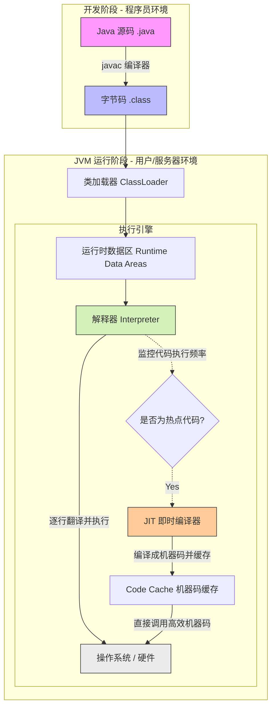

### 1、Java 程序执行全过程

```mermaid
graph TD

    subgraph Development [开发阶段 - 程序员环境]

        A[Java 源码 .java] -->|javac 编译器| B[字节码 .class]

    end

  

    subgraph JVM_Runtime [JVM 运行阶段 - 用户/服务器环境]

        B --> C[类加载器 ClassLoader]

        C --> D[运行时数据区 Runtime Data Areas]

        subgraph Execution_Engine [执行引擎]

            D --> E[解释器 Interpreter]

            E -->|逐行翻译并执行| F[操作系统 / 硬件]

            E -.->|监控代码执行频率| G{是否为热点代码?}

            G -.->|Yes| H[JIT 即时编译器]

            H -->|编译成机器码并缓存| I[Code Cache 机器码缓存]

            I -->|直接调用高效机器码| F

        end

    end

  

    %% 节点颜色区分

    style A fill:#f9f,stroke:#333

    style B fill:#bbf,stroke:#333

    style E fill:#d4f1bb,stroke:#333

    style H fill:#ffcc99,stroke:#333

    style F fill:#ececec,stroke:#333
```