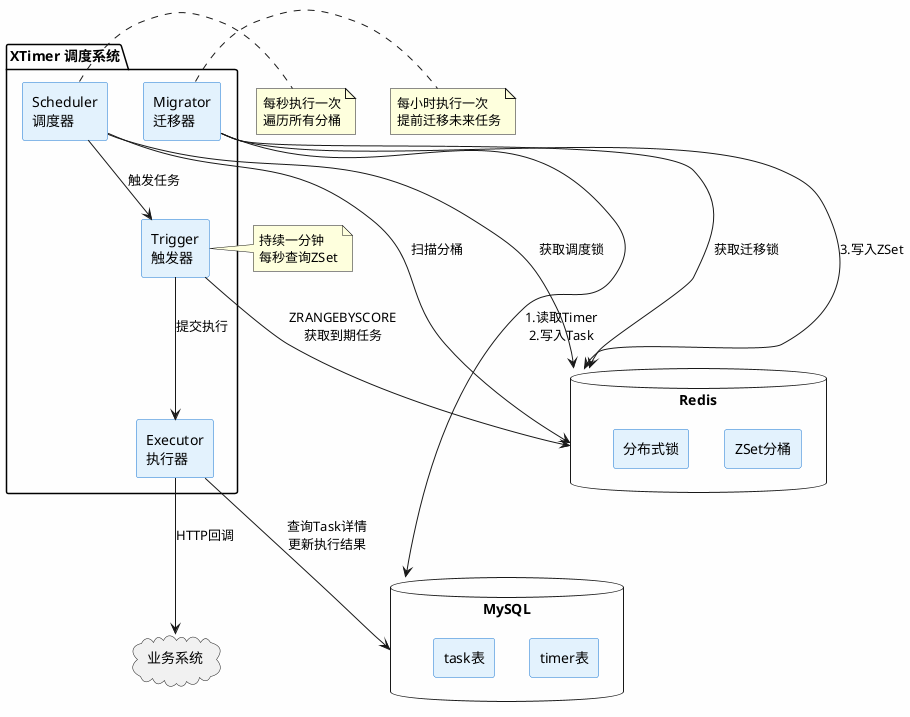
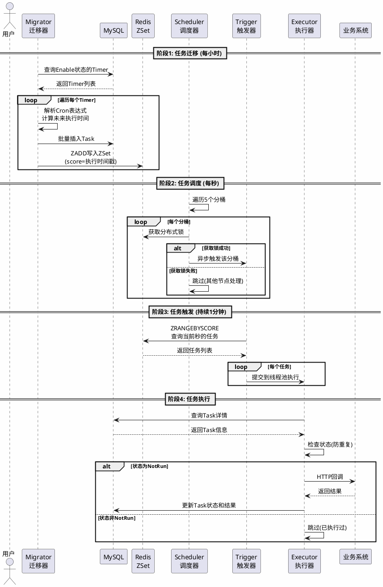
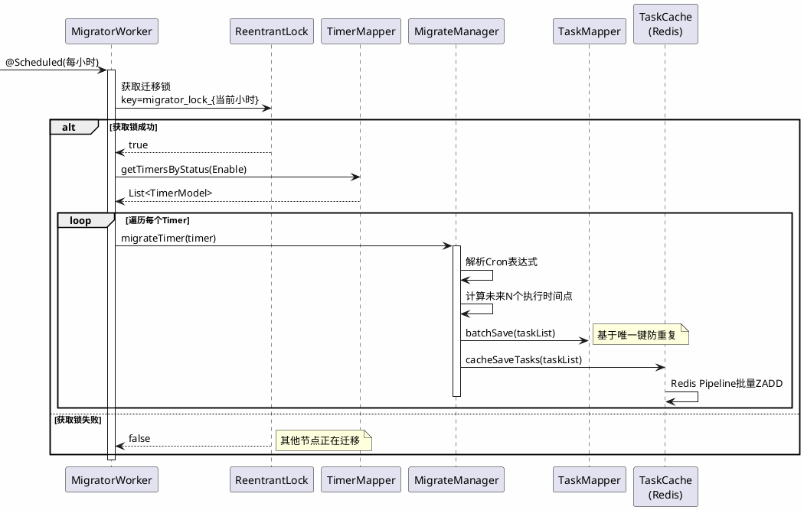
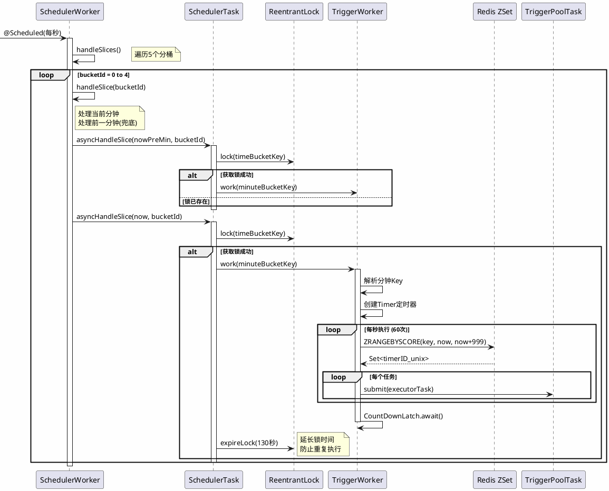
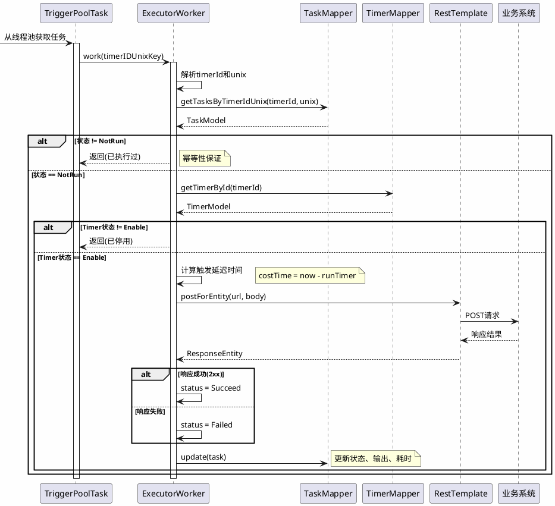
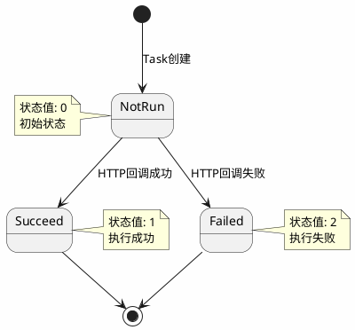
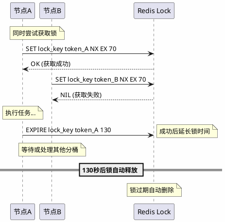
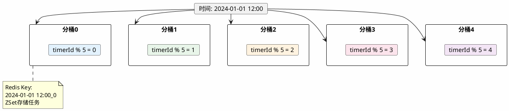

# XTimer 分布式定时任务调度系统 - 面试学习导读

> 本文档帮助你快速掌握项目核心设计，应对面试中的技术问题。

---

## 一、项目背景与定位

### 1.1 项目简介
XTimer 是一个基于 **Redis ZSet + 分桶策略** 的分布式定时任务调度框架，类似于精简版的 XXL-JOB、 Elastic-Job。

### 1.2 解决什么问题？
| 问题 | 传统方案 | XTimer 方案 |
|------|----------|-------------|
| 单点故障 | 单机 Timer/ ScheduledTask | 分布式多节点 |
| 精度控制 | 分钟级轮询 | 秒级 ZSet 精确触发 |
| 高并发 | 数据库轮询压力大 | Redis 缓存 + 分桶 |
| 可扩展性 | 无法水平扩展 | 分桶策略支持扩展 |

### 1.3 应用场景
- 订单超时自动取消
- 定时消息推送
- 周期性数据同步
- 延迟任务处理

---

## 二、核心架构（必考）

### 2.1 整体架构图

```
┌─────────────────────────────────────────────────────────────────────┐
│                          XTimer 系统架构                             │
├─────────────────────────────────────────────────────────────────────┤
│                                                                     │
│   ┌─────────────┐                              ┌─────────────┐      │
│   │   Client    │ ◀───── HTTP 回调 ──────────  │   Executor  │      │
│   │  (业务系统)  │                              │   执行器     │      │
│   └─────────────┘                              └──────┬──────┘      │
│                                                       │             │
│   ┌─────────────┐    ┌─────────────┐    ┌────────────▼─────┐      │
│   │  Migrator   │───▶│    Redis    │◀───│    Scheduler     │      │
│   │   迁移器    │    │   ZSet桶    │    │      调度器       │      │
│   └──────┬──────┘    └──────┬──────┘    └────────┬─────────┘      │
│          │                  │                    │                 │
│          ▼                  │                    ▼                 │
│   ┌─────────────┐           │           ┌─────────────┐           │
│   │    MySQL    │◀──────────┼───────────│   Trigger   │           │
│   │ Timer/Task  │           │           │    触发器    │           │
│   └─────────────┘           │           └─────────────┘           │
│                             │                                       │
└─────────────────────────────────────────────────────────────────────┘
```

### 2.2 四大组件职责

| 组件 | 职责 | 执行频率 | 关键代码文件 |
|------|------|----------|--------------|
| **Migrator** | 将未来任务从MySQL迁移到Redis | 每小时 | `MigratorWorker.java` |
| **Scheduler** | 按分钟扫描Redis分桶 | 每秒 | `SchedulerWorker.java` |
| **Trigger** | 秒级精确触发任务 | 持续1分钟 | `TriggerWorker.java` |
| **Executor** | 执行HTTP回调业务系统 | 实时 | `ExecutorWorker.java` |

### 2.3 数据流转图

```
┌──────────┐    1.创建Timer     ┌──────────┐
│  用户API  │ ──────────────────▶│  MySQL   │
└──────────┘                    └──────────┘
                                     │
      ┌──────────────────────────────┘
      ▼ 2.Migrator根据Cron计算执行时间
┌──────────┐                    ┌──────────┐
│  MySQL   │ ────写入Task─────▶│  Redis   │
│(持久化)   │                    │  (ZSet)  │
└──────────┘                    └──────────┘
                                     │
      ┌──────────────────────────────┘
      ▼ 3.Scheduler扫描 → 4.Trigger触发
┌──────────┐                    ┌──────────┐
│ Executor │ ────5.HTTP回调───▶│ 业务系统  │
└──────────┘                    └──────────┘
      │
      ▼ 6.更新结果
┌──────────┐
│  MySQL   │
└──────────┘
```

---

## 三、PlantUML 架构图（可视化理解）

### 3.1 系统组件图



### 3.2 完整任务执行时序图



### 3.3 Migrator 迁移时序图



### 3.4 Scheduler-Trigger 调度时序图



### 3.5 Executor 执行时序图



### 3.6 Task 状态机图



### 3.7 分布式锁工作流程



### 3.8 分桶策略示意图



---

## 四、核心设计详解（重点）

### 4.1 Redis ZSet 时间轮设计

**面试题：为什么用 ZSet？如何实现秒级精度？**

```java
// Key: 时间分桶 "2024-01-01 12:00_0" (时间_桶ID)
// Value: "timerID_unix" (任务标识)
// Score: Unix 时间戳 (执行时间)

redisTemplate.opsForZSet().add(
    "2024-01-01 12:00_0",    // 分桶Key
    "1001_1704088830",        // timerId_runTimer
    1704088830                // score = 执行时间戳
);
```

**查询方式**：
```java
// 每秒查询当前秒需要执行的任务
Set<Object> tasks = redisTemplate.opsForZSet()
    .rangeByScore(key, now, now + 999);  // 精确到秒
```
 
### 4.2 分桶策略

**面试题：如何支持高并发？分桶的作用是什么？**

```java
// TaskCache.java
public String GetTableName(TaskModel taskModel) {
    int maxBucket = schedulerAppConf.getBucketsNum(); // 5个桶
    SimpleDateFormat sdf = new SimpleDateFormat("yyyy-MM-dd HH:mm");
    String timeStr = sdf.format(new Date(taskModel.getRunTimer()));
    long index = taskModel.getTimerId() % maxBucket;  // 取模分桶
    return timeStr + "_" + index;  // "2024-01-01 12:00_2"
}
```

**优势**：
- 分散单个 Key 的压力
- 支持多节点并行处理不同桶
- 避免大 Key 问题

### 4.3 分布式锁设计

**面试题：如何保证任务不被重复执行？**

```java
// SchedulerTask.java - 调度锁
boolean ok = reentrantDistributeLock.lock(
    TimerUtils.GetTimeBucketLockKey(date, bucketId),  // 锁Key
    lockToken,                                         // 锁标识
    schedulerAppConf.getTryLockSeconds()              // 超时时间
);

// 成功后延长锁时间，防止重复执行
reentrantDistributeLock.expireLock(
    lockKey, lockToken,
    schedulerAppConf.getSuccessExpireSeconds()  // 130秒
);
```

**锁的设计要点**：
1. **锁粒度**: 时间分桶级别（分钟+桶ID）
2. **防死锁**: 超时自动释放
3. **防误删**: lockToken 标识归属
4. **延长机制**: 成功执行后延长锁时间

### 4.4 兜底重试机制

**面试题：任务执行失败怎么办？**

```java
// SchedulerWorker.java
private void handleSlice(int bucketId) {
    Date now = new Date();
    Date nowPreMin = new Date(now.getTime() - 60000);  // 前一分钟

    // 同时处理当前分钟和前一分钟
    schedulerTask.asyncHandleSlice(nowPreMin, bucketId);  // 重试
    schedulerTask.asyncHandleSlice(now, bucketId);        // 正常
}
```

**重试原理**：
- 如果上次执行成功 → 锁被延长 → 本次跳过
- 如果上次执行失败 → 锁已过期 → 本次重试

---

## 五、数据库设计

### 5.1 表结构

**Timer 表（定时器定义）**
```sql
CREATE TABLE timer (
    timer_id BIGINT PRIMARY KEY AUTO_INCREMENT,
    app VARCHAR(64),           -- 应用标识
    name VARCHAR(128),         -- 定时器名称
    status INT,                -- 状态：1-启用 0-停用
    cron VARCHAR(64),          -- Cron表达式
    notify_http_param TEXT,    -- 回调参数JSON
    created_at DATETIME,
    updated_at DATETIME
);
```

**Task 表（任务实例）**
```sql
CREATE TABLE task (
    task_id INT PRIMARY KEY AUTO_INCREMENT,
    app VARCHAR(64),
    timer_id BIGINT,           -- 关联Timer
    run_timer BIGINT,          -- 执行时间戳
    status INT,                -- 状态：0-未执行 1-成功 2-失败
    output TEXT,               -- 执行结果
    cost_time INT,             -- 耗时(毫秒)
    UNIQUE KEY (timer_id, run_timer)  -- 防止重复
);
```

### 5.2 状态流转

```
┌─────────────────────────────────────────────────┐
│                   Task 状态流转                   │
├─────────────────────────────────────────────────┤
│                                                 │
│   ┌──────────┐     执行成功     ┌──────────┐   │
│   │  NotRun  │ ───────────────▶ │ Succeed  │   │
│   │   (0)    │                  │   (1)    │   │
│   └────┬─────┘                  └──────────┘   │
│        │                                       │
│        │ 执行失败                               │
│        ▼                                       │
│   ┌──────────┐                                 │
│   │  Failed  │                                 │
│   │   (2)    │                                 │
│   └──────────┘                                 │
│                                                 │
└─────────────────────────────────────────────────┘
```

---

## 六、面试高频问题

### Q1: 为什么用 Redis ZSet 而不是直接数据库轮询？

**答案要点**：
1. **性能**: ZSet 的 ZRANGEBYSCORE 时间复杂度 O(logN + M)，远优于数据库全表扫描
2. **精度**: Score 存储时间戳，支持秒级精确触发
3. **有序性**: 天然排序，无需额外排序操作
4. **减轻DB压力**: 高频查询走 Redis，数据库只做持久化

### Q2: 如何保证任务不丢失？

**答案要点**：
1. **双重存储**: MySQL 持久化 + Redis 缓存
2. **兜底重试**: 同时处理当前和前一分钟
3. **分布式锁超时**: 锁过期后可被其他节点接管
4. **幂等设计**: timer_id + run_timer 唯一键防重复

### Q3: 如何保证任务不被重复执行？

**答案要点**：
1. **分布式锁**: 调度层面锁住分桶
2. **状态检查**: Executor 执行前检查 Task 状态
```java
if (task.getStatus() != TaskStatus.NotRun.getStatus()) {
    log.warn("重复执行任务");
    return;
}
```
3. **数据库唯一键**: timer_id + run_timer

### Q4: 系统如何水平扩展？

**答案要点**：
1. **分桶策略**: 增加 bucketsNum 配置
2. **无状态设计**: 所有 Worker 无本地状态
3. **竞争锁机制**: 多节点竞争分布式锁，谁抢到谁执行
4. **Nacos 注册**: 自动服务发现

### Q5: Migrator 为什么要提前迁移任务？

**答案要点**：
1. **预热**: 避免运行时计算 Cron，减少延迟
2. **批量处理**: 小时级批量迁移，效率更高
3. **容错**: MySQL 持久化保证任务不丢失
4. **解耦**: 迁移和执行分离，职责清晰

### Q6: Cron 表达式如何解析？

```java
// 使用 Quartz 的 CronExpression
CronExpression cronExpression = new CronExpression(timerModel.getCron());
Date nextTime = cronExpression.getNextValidTimeAfter(now);
```

### Q7: 系统有哪些可配置参数？

| 参数 | 默认值 | 说明 |
|------|--------|------|
| `scheduler.bucketsNum` | 5 | 分桶数量 |
| `scheduler.tryLockSeconds` | 70 | 获取锁超时 |
| `scheduler.successExpireSeconds` | 130 | 成功后锁过期时间 |
| `trigger.zrangeGapSeconds` | 1 | ZSet查询间隔 |
| `migrator.migrateStepMinutes` | 60 | 迁移时间步长 |

---

## 七、项目亮点总结

### 7.1 架构亮点
- **四层解耦**: Migrator → Scheduler → Trigger → Executor
- **秒级精度**: Redis ZSet Score 存储时间戳
- **分桶扩展**: 支持水平扩展，分散压力

### 7.2 可靠性亮点
- **双重存储**: MySQL + Redis
- **分布式锁**: 防止重复执行
- **兜底重试**: 前一分钟机制

### 7.3 性能亮点
- **异步线程池**: 高并发处理
- **批量操作**: Redis Pipeline 批量写入
- **缓存预热**: Migrator 提前迁移

---

## 八、学习路径建议

### 第一阶段：理解架构（1-2天）
1. 阅读本文档，建立整体认知
2. 画出数据流转图
3. 理解四大组件职责

### 第二阶段：代码精读（3-5天）
1. **入口文件**: `XTimerApplication.java`
2. **核心流程**:
   - `MigratorWorker.java` → `MigrateManagerImpl.java`
   - `SchedulerWorker.java` → `SchedulerTask.java`
   - `TriggerWorker.java` → `TriggerPoolTask.java`
   - `ExecutorWorker.java`
3. **辅助类**:
   - `TaskCache.java` (Redis 操作)
   - `TimerUtils.java` (工具方法)

### 第三阶段：面试准备（1-2天）
1. 背诵本文档的面试问题
2. 自己画架构图
3. 模拟讲解项目设计思路

---

## 九、扩展思考

### 9.1 可以优化的点
1. **任务分片**: 大任务拆分并行执行
2. **失败重试策略**: 指数退避重试
3. **监控告警**: 集成 Prometheus + Grafana
4. **可视化控制台**: Web 管理界面

### 9.2 与同类框架对比

| 特性 | XTimer | XXL-JOB | Elastic-Job |
|------|--------|---------|-------------|
| 复杂度 | 简单 | 中等 | 复杂 |
| 依赖 | Redis+MySQL | MySQL | Zookeeper |
| 分片 | 分桶 | 分片广播 | 分片 |
| 控制台 | 无 | 有 | 有 |

---

## 十、核心代码索引

| 功能模块 | 核心文件 | 关键方法 |
|----------|----------|----------|
| 应用启动 | `XTimerApplication.java` | `main()` |
| 任务迁移 | `MigratorWorker.java` | `migrate()` |
| 迁移逻辑 | `MigrateManagerImpl.java` | `migrateTimer()` |
| 任务调度 | `SchedulerWorker.java` | `handleSlices()` |
| 异步处理 | `SchedulerTask.java` | `asyncHandleSlice()` |
| 任务触发 | `TriggerWorker.java` | `work()` |
| 定时查询 | `TriggerTimerTask.java` | `run()` |
| 任务执行 | `ExecutorWorker.java` | `work()` |
| Redis操作 | `TaskCache.java` | `cacheSaveTasks()` |
| 数据模型 | `TimerModel.java` / `TaskModel.java` | - |

---

> **祝面试顺利！**
>
> 记住：理解比背诵更重要，能用自己话讲清楚才是真正掌握。
