## 一、项目定位

本 Bot 主要面向群聊中的**价值投资相关信息获取、整理、分析与分享**。

核心业务包括：

1. 群聊 ETF 股票池管理及实时行情查询
    
2. 专家聊天记录精读与 SAI 选推荐整理
    
3. B站 UP 主更新监听与视频精读
    
4. 股票投研报告生成
    
5. 群聊消息统一拦截、权限控制与命令路由
    

Bot 原则上**不参与普通群聊**，只响应已经定义的业务命令及后台任务。

---

# 二、系统角色与权限

系统采用三级角色模型：

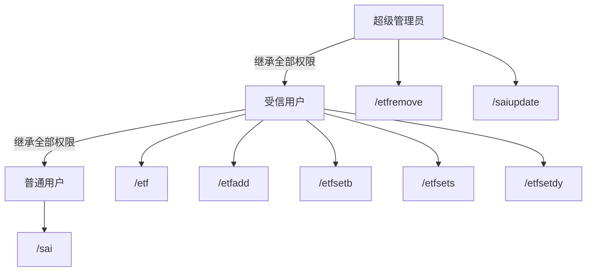

## 2.1 超级管理员

超级管理员拥有全部受信用户及普通用户权限。

额外权限：

|命令|功能|
|---|---|
|`/etfremove`|移除群聊 ETF 股票|
|`/saiupdate`|手动触发 SAI 选缓存构建|

---

## 2.2 受信用户

受信用户拥有全部普通用户权限。

额外权限：

|命令|功能|
|---|---|
|`/etf`|查看当前群聊 ETF 列表及实时行情|
|`/etfadd`|添加群聊 ETF 股票|
|`/etfsetb`|设置 SAI 选 B 点|
|`/etfsets`|设置 SAI 选 S 点|
|`/etfsetdy`|设置 SAI 前瞻股息率|

---

## 2.3 普通用户

普通用户拥有基础业务权限：

|命令|功能|
|---|---|
|`/sai`|获取 SAI 选推荐|

---

# 三、插件设计

# 插件 1：群聊 ETF

## 3.1 功能概述

维护每个群聊独立的 ETF 股票池，并提供股票实时行情及 SAI 投资指标查询。

每个群聊拥有独立的 ETF 配置，不同群聊之间互不影响。

---

## 3.2 命令

|命令|权限|功能|
|---|---|---|
|`/etf`|受信用户、超级管理员|展示当前群聊 ETF 列表及实时行情|
|`/etfadd`|受信用户、超级管理员|添加群聊 ETF 股票|
|`/etfremove`|超级管理员|移除群聊 ETF 股票|
|`/etfsetb`|受信用户、超级管理员|设置 SAI 选 B 点|
|`/etfsets`|受信用户、超级管理员|设置 SAI 选 S 点|
|`/etfsetdy`|受信用户、超级管理员|设置 SAI 前瞻股息率|

---

## 3.3 `/etf`

### 命令

```text
/etf
```

### 响应

返回当前群聊 ETF 股票列表及实时行情。

### 展示字段

|字段|说明|数据来源|
|---|---|---|
|股票名称|股票名称|Wind|
|股票代码|股票代码|Wind|
|现价|当前实时价格|Wind|
|股息率 TTM|TTM 股息率|Wind|
|SAI 选 B 点|SAI 买入参考点|用户配置|
|SAI 选 S 点|SAI 卖出参考点|用户配置|
|SAI 前瞻股息率|根据当前价格动态计算|用户配置 + 实时价格|

---

## 3.4 `/etfadd`

### 命令

```text
/etfadd <股票代码或股票名称>
```

### 权限

受信用户、超级管理员。

### 功能

向当前群聊 ETF 股票池中添加指定股票。

### 注意事项

股票标的应能够唯一确定。

如果无法唯一确定标的，应要求用户提供完整股票代码或股票全称。

---

## 3.5 `/etfremove`

### 命令

```text
/etfremove <股票代码或股票名称>
```

### 权限

仅超级管理员。

### 功能

从当前群聊 ETF 股票池中移除指定股票。

---

## 3.6 `/etfsetb`

### 命令

```text
/etfsetb <股票> <B点>
```

### 权限

受信用户、超级管理员。

### 功能

设置指定股票的 SAI 选 B 点。

---

## 3.7 `/etfsets`

### 命令

```text
/etfsets <股票> <S点>
```

### 权限

受信用户、超级管理员。

### 功能

设置指定股票的 SAI 选 S 点。

---

## 3.8 `/etfsetdy`

### 命令

```text
/etfsetdy <股票> <前瞻股息率>
```

### 权限

受信用户、超级管理员。

### 功能

设置指定股票的 SAI 前瞻股息率基准。

### 动态计算规则

SAI 前瞻股息率不是固定展示值，而是会随着当前股价变化而动态变化。

例如：

用户设置时：

```text
股票价格 = 10 元
SAI 前瞻股息率 = 5.0%
```

则对应的预期年度股息金额：

```text
10 × 5.0% = 0.50 元
```

后续当前股价变为 8 元，则：

```text
0.50 ÷ 8 = 6.25%
```

因此：

```text
预期年度股息 = 设置时价格 × 设置时前瞻股息率

当前前瞻股息率 = 预期年度股息 ÷ 当前实时价格
```

### 默认值

如果尚未设置 SAI 指标，则展示：

```text
SAI 选 B 点：/
SAI 选 S 点：/
SAI 前瞻股息率：/
```

---

## 3.9 ETF 查询流程

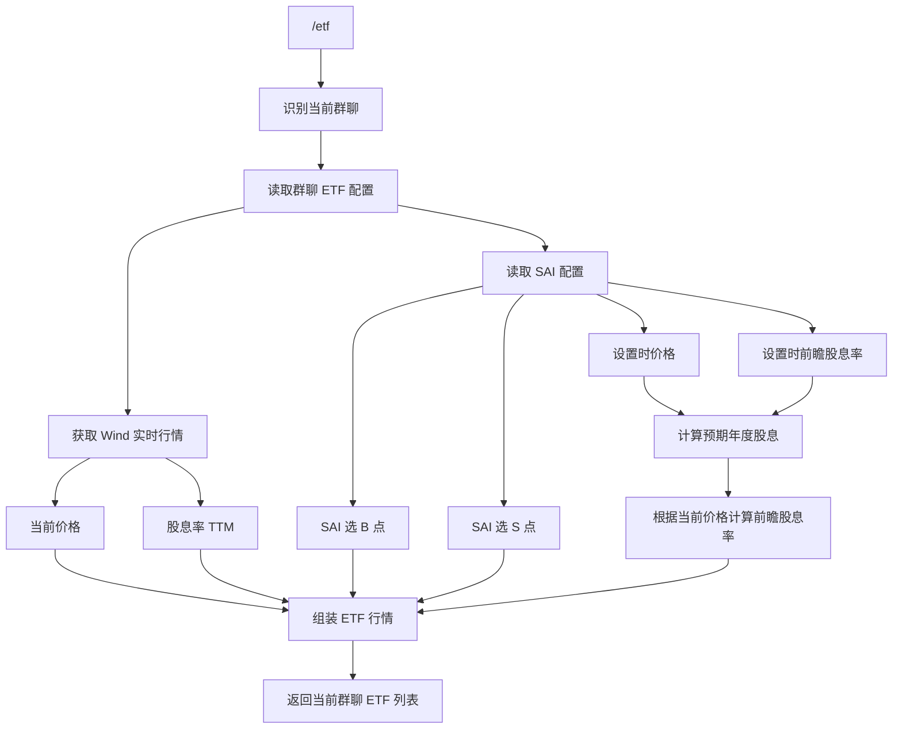

---

# 插件 2：SAI 选整理

## 4.1 业务背景

SAI 选来自聊天记录中的专家精选。

系统每天定时对专家聊天记录进行精读，从聊天记录中提取专家明确、有效的投资观点，形成 SAI 选推荐。

需要主动过滤：

- 非投资相关内容
    
- 普通闲聊
    
- 无明确投资观点的信息
    
- 无法确认具体投资标的信息
    
- 其他与投资无关的内容
    

每次精读结果按照年月日进行归档，并保存到本地固定目录。

---

## 4.2 专家聊天记录精读

每天执行 3 次：

|时间|任务|
|---|---|
|08:30|专家聊天记录精读|
|12:30|专家聊天记录精读|
|00:00|专家聊天记录精读|

每次精读：

1. 获取对应专家聊天记录
    
2. 对聊天内容进行精读
    
3. 提取明确的投资观点
    
4. 识别推荐股票及其他投资标的
    
5. 提取 B/S 推荐点
    
6. 提取备注
    
7. 提取推荐日期
    
8. 删除非投资相关内容
    
9. 保存结构化结果
    

---

## 4.3 SAI 推荐数据

每个推荐标的尽可能包含：

|字段|说明|
|---|---|
|股票名称|推荐标的名称|
|股票代码|推荐标的代码|
|B/S 推荐点|专家明确给出的 B/S 点位|
|备注|专家投资观点及补充信息|
|推荐日期|推荐观点产生日期|
|原始信息|必要时保留原始聊天记录引用|

### 数据完整性原则

如果原始聊天记录中没有明确给出某个字段：

> 不允许 Agent 自行推测或编造。

应当：

- 保留为空；或
    
- 使用 `/` 等占位符。
    

---

## 4.4 本地归档

每次精读结果按照年月日保存到本地固定目录。

建议逻辑结构：

```text
SAI/
├── 2026-08-20/
│   ├── 08-30.md
│   ├── 12-30.md
│   └── 00-00.md
├── 2026-08-21/
│   ├── 08-30.md
│   ├── 12-30.md
│   └── 00-00.md
└── ...
```

具体目录结构以后续实现为准。

---

## 4.5 SAI 推荐缓存构建

每天执行 3 次：

|时间|任务|
|---|---|
|08:40|更新 SAI 选缓存|
|12:40|更新 SAI 选缓存|
|00:10|更新 SAI 选缓存|

每次构建包含：

1. 今日 SAI 选推荐
    
2. 过去 7 天 SAI 选推荐
    
3. 过去 30 天 SAI 选推荐
    

处理流程：

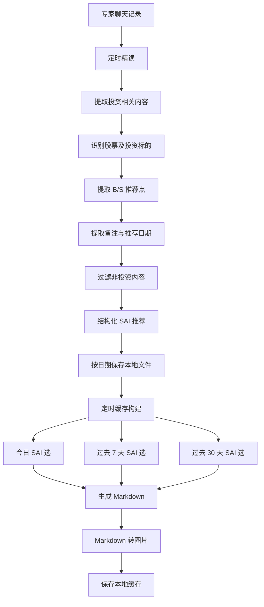

---

## 4.6 `/sai`

### 命令

```text
/sai
```

### 权限

普通用户及以上。

### 功能

获取本地已经构建好的 SAI 选推荐缓存，并发送到当前会话。

### 内容

包含：

1. 今日 SAI 选推荐
    
2. 过去 7 天 SAI 选推荐
    
3. 过去 30 天 SAI 选推荐
    

### 注意事项

推荐内容统一转换为图片后发送。

用户执行 `/sai` 时：

> **只读取缓存，不重新执行聊天记录精读及报告生成。**

### 流程

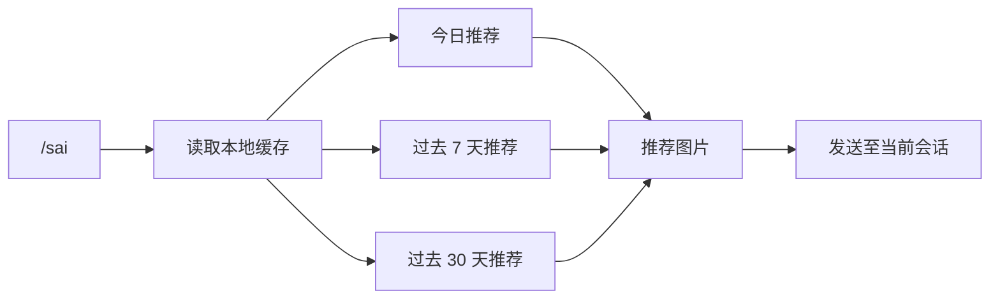

---

## 4.7 `/saiupdate`

### 命令

```text
/saiupdate
```

### 权限

超级管理员。

### 功能

立即触发 SAI 选缓存构建。

### 流程

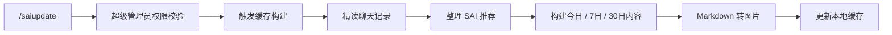

主要用于：

- 手动刷新缓存
    
- 定时任务异常后的恢复
    
- 调试 SAI 选生成流程
    

---

## 4.8 SAI 定时群聊推送

支持定时向指定目标群聊自动推送 SAI 选推荐。

### 配置

- 目标群聊列表
    
- 是否启用推送
    
- 推送时间
    

### 流程

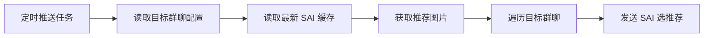

---

# 插件 3：B站助手

## 5.1 功能概述

B站助手主要提供两个能力：

1. UP 主更新监听
    
2. B站视频精读
    

---

## 5.2 功能一：UP 主更新监听

### 命令

```text
/b站监听 <uid>
```

### 参数

`uid`：B站 UP 主 UID。

### 功能

支持配置指定 UP 主列表。

系统每 5 分钟轮询一次视频更新，发现新视频后自动推送到配置的目标群聊。

### 配置

- UP 主 UID 列表
    
- 目标群聊列表
    
- 轮询周期
    

默认轮询周期：

```text
5 分钟
```

### 流程

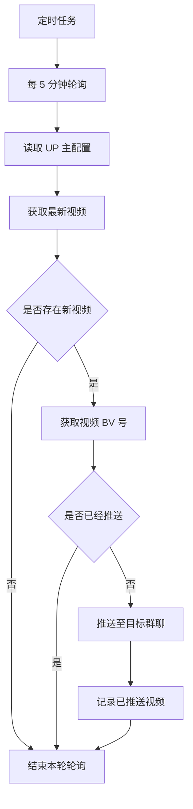

### 去重要求

必须避免同一视频重复推送。

建议以 B站视频唯一标识作为幂等键，例如：

```text
BVxxxxxx
```

已推送记录需要持久化，避免 Bot 重启后再次重复推送。

---

# 5.3 功能二：视频精读

### 命令

支持：

```text
/ b站精读 <视频>
/ b站精读 <自然文本>
```

实际命令不包含空格：

```text
/b站精读 <视频>
/b站精读 <自然文本>
```

### 参数

- `x`：B站视频
    
- `y`：自然文本，其中需要能够提取 B站视频链接
    

例如：

```text
/ b站精读 https://www.bilibili.com/video/BVxxxx
```

或者：

```text
/ b站精读 帮我看看这个视频 https://www.bilibili.com/video/BVxxxx
```

### 响应

返回视频精读 PDF 报告，并发送到当前会话。

### 字幕获取策略

优先：

```text
bili cli
```

失败后：

```text
whisper-base
```

### 完整流程

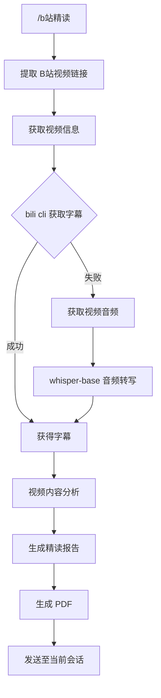

### 注意事项

字幕获取必须遵循：

> `bili cli` 为首选方案，`whisper-base` 为兜底方案。

只有字幕获取失败后才进行音频转写。

---

# 插件 4：股票投研

## 6.1 功能概述

允许用户输入 A 股股票代码或股票名称，通过 `invest skill` 生成股票投研报告，并转换成 PDF 发送至当前会话。

---

## 6.2 命令

### 主命令

```text
/投研
```

### 别名

```text
/invest
```

### 示例

```text
/投研 600519
/投研 贵州茅台
```

---

## 6.3 响应

返回股票投研 PDF 报告。

---

## 6.4 标的识别

默认分析：

```text
A股
```

用户可以输入：

- 股票代码
    
- 股票名称
    

系统首先进行股票标的识别。

如果用户提供的信息不足以唯一确定标的：

> 不允许 Agent 自行猜测。

应提醒用户提供：

- 完整股票代码；或
    
- 正确股票全称。
    

例如：

```text
/投研 长江
```

如果存在多个可能标的，应要求用户进一步确认。

---

## 6.5 投研流程

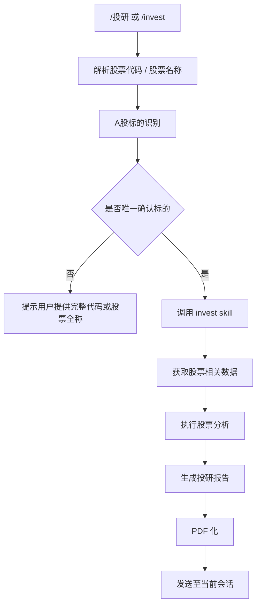

---

# 插件 5：机器人行为控制

## 7.1 消息统一拦截

所有群聊消息首先进入 Bot 统一消息入口。

根据：

- 用户身份
    
- 当前群聊
    
- 消息内容
    
- 命令类型
    
- 插件权限
    

进行统一判断与业务分发。

### 消息处理流程

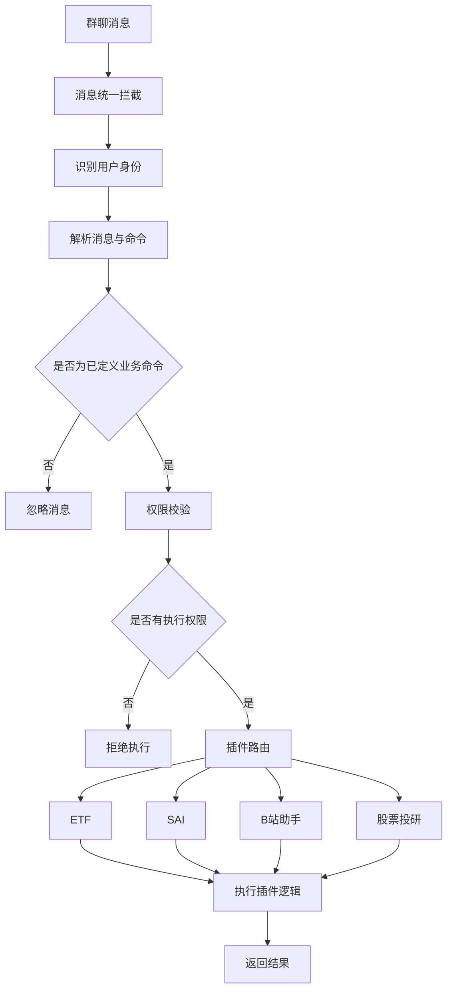

---

## 7.2 无关消息处理

Bot 在目标群聊中不参与普通聊天。

以下类型默认不响应：

```text
@Bot 你好
@Bot 在吗
@Bot 今天怎么样
普通闲聊
未定义命令
与业务无关的问题
```

核心原则：

> Bot 只响应已定义的业务功能和命令。

---

## 7.3 权限控制原则

所有命令进入具体插件前必须进行权限校验。

权限关系：

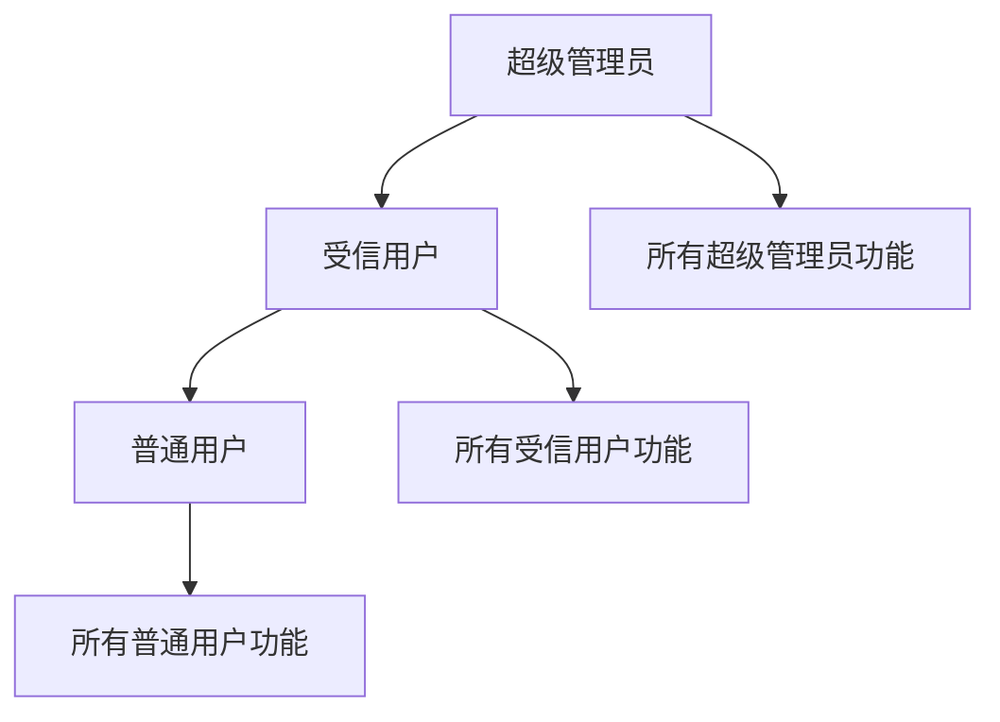

禁止通过：

- 自然语言
    
- 命令参数
    
- 消息格式
    
- 插件内部调用
    

绕过权限校验。

---

# 四、系统总体架构

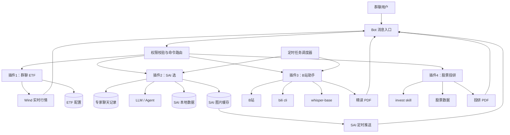

---

# 五、后台定时任务

|时间 / 周期|任务|插件|
|---|---|---|
|08:30|专家聊天记录精读|SAI 选|
|08:40|SAI 选缓存构建|SAI 选|
|12:30|专家聊天记录精读|SAI 选|
|12:40|SAI 选缓存构建|SAI 选|
|00:00|专家聊天记录精读|SAI 选|
|00:10|SAI 选缓存构建|SAI 选|
|每 5 分钟|UP 主视频更新轮询|B站助手|
|手动触发|`/saiupdate`|SAI 选|

---

# 六、命令总览

|命令|权限|插件|功能|
|---|---|---|---|
|`/etf`|受信用户 / 超级管理员|群聊 ETF|查看 ETF 列表及实时行情|
|`/etfadd`|受信用户 / 超级管理员|群聊 ETF|添加 ETF|
|`/etfremove`|超级管理员|群聊 ETF|移除 ETF|
|`/etfsetb`|受信用户 / 超级管理员|群聊 ETF|设置 SAI B 点|
|`/etfsets`|受信用户 / 超级管理员|群聊 ETF|设置 SAI S 点|
|`/etfsetdy`|受信用户 / 超级管理员|群聊 ETF|设置 SAI 前瞻股息率|
|`/sai`|普通用户及以上|SAI 选|获取 SAI 选推荐|
|`/saiupdate`|超级管理员|SAI 选|手动更新 SAI 缓存|
|`/b站监听`|待定义|B站助手|配置 UP 主监听|
|`/b站精读`|普通用户及以上|B站助手|视频精读并生成 PDF|
|`/投研`|普通用户及以上|股票投研|股票投研并生成 PDF|
|`/invest`|普通用户及以上|股票投研|`/投研` 英文别名|

---

# 七、核心设计原则

## 7.1 Bot 定位

Bot 主要服务于：

> **价值投资相关的信息获取、整理、分析与分享。**

不承担通用聊天机器人职责。

---

## 7.2 命令优先

业务功能原则上通过明确命令触发。

对于普通用户的：

- 艾特
    
- 闲聊
    
- 未定义命令
    
- 无关问题
    

默认不响应。

---

## 7.3 数据与展示分离

对于 SAI 选这种计算成本较高的功能，采用：

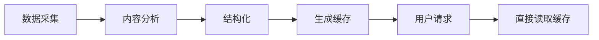

避免每次用户执行 `/sai` 时重新执行完整 Agent 流程。

---

## 7.4 定时任务与手动任务并存

核心后台任务由 Scheduler 自动执行，同时提供管理员手动触发入口。

例如：

```text
/saiupdate
```

用于：

- 手动刷新
    
- 异常恢复
    
- 调试
    
- 强制重新构建缓存
    

---

## 7.5 投资信息不得自行臆测

涉及以下信息时：

- 股票标的
    
- B/S 点
    
- 股息率
    
- 专家观点
    
- 推荐日期
    
- 投资结论
    

如果原始数据没有明确给出：

> 不允许 Agent 自行推测或编造。

应保留为空或使用 `/` 占位。

---

## 7.6 插件独立

各插件尽量保持业务独立，由统一的 Bot 入口负责：

```text
消息接收
    ↓
身份识别
    ↓
命令解析
    ↓
权限校验
    ↓
插件路由
    ↓
具体业务
```

插件内部负责自身的：

- 业务逻辑
    
- 数据访问
    
- 外部服务调用
    
- 定时任务
    
- 缓存
    
- 结果生成
    

避免不同插件之间形成不必要的强耦合。

---

# 八、后续待确定事项

以下内容目前原始设计中尚未完全确定，开发时再补充：

1. `/etfadd`、`/etfremove` 等命令的具体参数格式。
    
2. ETF 股票池的持久化方式及数据结构。
    
3. Wind API 的具体调用方式。
    
4. SAI 选数据本地目录结构。
    
5. 专家聊天记录的获取方式。
    
6. SAI 精读所使用的具体 Agent / Skill。
    
7. SAI 推荐 Markdown 的固定模板。
    
8. SAI 推荐图片的具体排版模板。
    
9. SAI 定时推送的具体时间。
    
10. `/b站监听` 的完整配置命令及权限。
    
11. B站监听配置的持久化方式。
    
12. 已推送视频的持久化及过期策略。
    
13. `bili cli` 的具体调用方式。
    
14. `whisper-base` 的部署方式及硬件要求。
    
15. 视频精读 PDF 的固定模板。
    
16. `invest skill` 的具体输入输出协议。
    
17. 股票投研 PDF 的固定模板。
    
18. Bot 所有配置的统一存储方式。
    
19. 定时任务调度框架及异常重试策略。
    
20. 插件统一的日志、异常处理及监控机制。
    

---

# 九、最终业务结构

整个 Bot 可以抽象为：

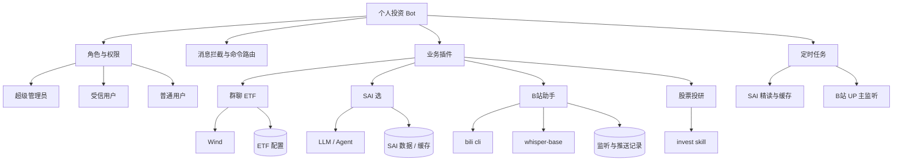

整体上形成：

**「统一消息入口 → 权限控制 → 命令路由 → 独立插件 → 外部能力 / 本地数据 → 结果返回或定时推送」**

的 Bot 架构。